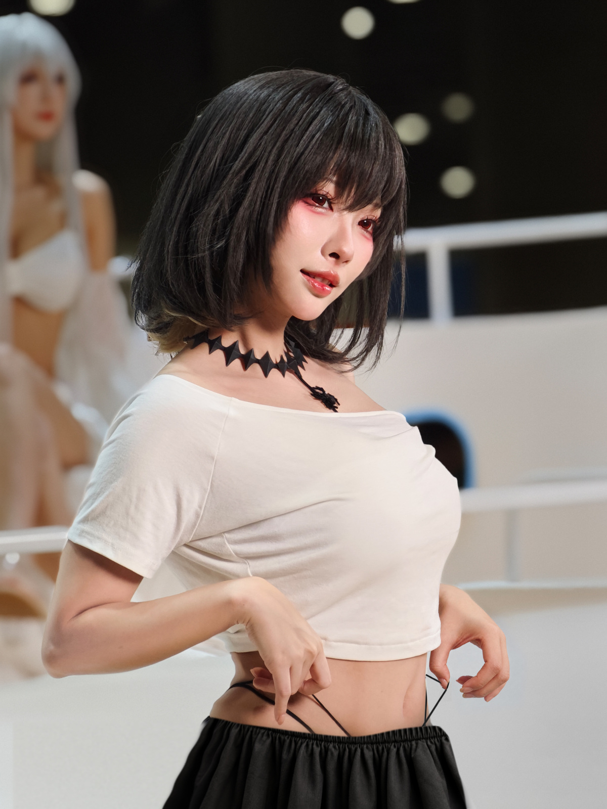
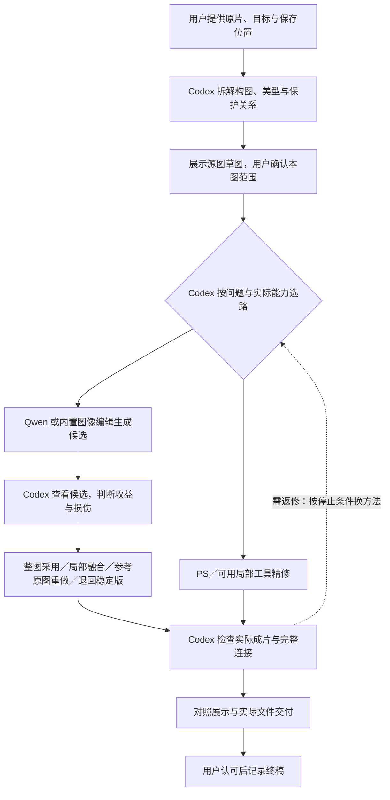

# natural-shaping · Cos 照片 P图与人像精修 Skill

**人像精修与 Cosplay 修图 Skill for Codex · Portrait & cosplay photo retouching**

用 AI 辅助 Cos 照片 P图、漫展修图与人像精修的可移植技能：先拆解构图、展示原片标注草图，确认后再精修肤质、五官、身形、光线与背景。保留本人感、角色妆造、关节和道具结构，并主动检查修后瑕疵。

A reusable **photo retouching agent skill** for Codex, focused on **portrait retouching** and **cosplay photo editing**. The workflow is defined in [`natural-shaping/SKILL.md`](natural-shaping/SKILL.md): source-based composition sketches, identity-preserving refinement and visual quality checks, with **Photoshop ExtendScript (JSX)** helpers. Codex chooses among the tools available in your environment: built-in image generation/editing can run the editing route without Qwen; Qwen is an optional backend, and Photoshop enables precise local work and layered delivery when available.

[实战教程与效果拆解](https://yeliannaa.github.io/natural-shaping/) · [安装与使用](#安装与使用) · [调用链与分工](#调用链与分工) · [缺少工具时如何继续](#缺少工具时如何继续) · [常见修图问题](#常见修图问题faq) · [按问题看案例](#按问题看案例) · [构图草图](#构图草图composition-sketches) · [10 张示例与版本状态](natural-shaping/assets/examples/README.md) · [完整流程](natural-shaping/SKILL.md)

## 代表效果与细节拆解

三组真实案例展示不同问题：**蕾姆的遮挡与衣装连接、群像的逐人补光、宫本樱的衣带受力与手部补全**。点击进入原片／终稿对照、构图标注和局部细节教学。

<table>
<tr><th>蕾姆 · 遮挡、彩光与袖口</th><th>群像 · 三人构图与气色</th><th>宫本樱 · 手部与双侧衣带</th></tr>
<tr>
<td><a href="https://yeliannaa.github.io/natural-shaping/rem.html"></a></td>
<td><a href="https://yeliannaa.github.io/natural-shaping/group.html"></a></td>
<td><a href="https://yeliannaa.github.io/natural-shaping/sakura.html"></a></td>
</tr>
<tr>
<td>看坐姿与相机形成的视觉路径，怎样检查发缘、黑色带子及手背—手腕—袖口的连续性。<a href="https://yeliannaa.github.io/natural-shaping/rem.html">详细拆解</a></td>
<td>看三张脸的层次、左侧人物眼周与唇色、前后人物关系，以及合影边缘的取舍。<a href="https://yeliannaa.github.io/natural-shaping/group.html">详细拆解</a></td>
<td>看双侧衣带的起点、数量、松紧与握点；腰腹修改还要联看肚脐、裤腰和手指。<a href="https://yeliannaa.github.io/natural-shaping/sakura.html">详细拆解</a></td>
</tr>
</table>

也可以直接在 GitHub 阅读[蕾姆](docs/rem.md)、[群像](docs/group.md)、[宫本樱](docs/sakura.md)的图文分析；[教程站源码与维护说明](docs/README.md)随仓库提供。

每页都把**位置 → 观看影响 → 处理判断 → 保护与验收**讲清楚，附整体对照与局部特写。蕾姆使用 v21，群像使用 111 v5；宫本樱 v8 结构获认可，v9 获保存指示。网页图片是轻量预览，原尺寸 JPG 仍在[成片示例目录](natural-shaping/assets/examples/README.md)。不同取景的整图对照用于观察构图与观感，不能当作像素叠图或处理幅度的测量。

## 三步开始

1. 按[安装与使用](#安装与使用)复制完整技能目录，并确认当前应用有实际图像编辑工具。
2. 提供照片与输出目录，调用 `$natural-shaping`；先查看基于原片的构图、美型与保护方案，再确认范围。
3. 检查实际成片及局部对照，认可后保存终稿。第一次使用可跟着[完整实战教程](https://yeliannaa.github.io/natural-shaping/first-photo.html)操作。

Qwen 是可选后端；内置图像编辑可独立承担生成路线。精确 PS 编辑和 PSD 交付需要实际 Photoshop 连接。详见[调用链](#调用链与分工)与[缺少工具时如何继续](#缺少工具时如何继续)。

## 能做什么

| 方向 | 工作内容 |
|---|---|
| 构图与沟通 | 分析留白、动作路径、画边与遮挡；给出可比较的原片草图，确认后执行 |
| 人像精修 | 分别判断肤质、五官、肩颈、腰腹及腿脚比例，保护身份和妆造 |
| 光线与背景 | 肤色与彩光衔接、按景深弱化路人、处理具体干扰并保留现场感 |
| 道具与验收 | 联看手、衣带、球拍等完整连接；查新增损伤、原尺寸细节与实际交付文件 |

包内提供方法、参考图和辅助脚本。修图效果取决于执行工具与实际验收；不包含像素蛋糕算法、Photoshop 软件或生图模型。

## 安装与使用

下载或克隆本仓库，将整个 [`natural-shaping/`](natural-shaping/) 文件夹放入目标应用支持的技能目录，保持内部目录结构；不要只复制 `SKILL.md`。不需要另外安装原作者的其他修图 skill。首次使用先阅读[移植说明](natural-shaping/references/portability.md)，确认应用已识别技能并检查实际工具入口；选择 PS／随包脚本路线时再用合成小图测试会用到的功能。

也可以通过 [Vercel Skills CLI](https://github.com/vercel-labs/skills) 安装。以下固定版本命令需要 Node.js 22.20.0 或更高版本；先列举仓库中的技能：

```sh
npx skills@1.7.1 add yeliannaa/natural-shaping --list
```

在目标项目目录中，为 Codex 复制安装该技能：

```sh
npx skills@1.7.1 add yeliannaa/natural-shaping --skill natural-shaping --agent codex --copy --yes
```

**安装验证（2026-10-07）**：独立 Windows 测试项目使用 Node.js 22.20.0、Skills CLI 1.7.1，识别出一个 `natural-shaping`，项目安装至 `.agents/skills/natural-shaping`；364 个文件的清单、哈希和本地引用通过包内校验。此项验证覆盖技能发现与复制安装，实际 Photoshop 连接和其他客户端执行能力仍按迁移说明检查。

**目录状态（2026-10-10）**：已有可访问的 [skills.sh 公开条目](https://www.skills.sh/yeliannaa/natural-shaping/natural-shaping)。仓库可安装、目录存在条目、普通用途搜索能否发现是三个分别核验的状态；条目存在不保证所有查询命中或固定排名。目录按真实安装遥测形成收录和排名，详见 [skills.sh 收录说明](https://skills.sh/docs/faq)。此前安装验证关闭了遥测，不把该次测试计作真实使用。

在支持 `$` 调用的 Codex 环境中，可提供照片或文件夹并这样请求：

```text
$natural-shaping 请先拆解这张 Cos 照的构图，展示基于原片的方案草图。
等我确认后，再精修肤质、五官、身形、背景和光线，并保存到我指定的目录。
```

每张新图或完整重修，应先展示草图并等待确认。同一方案内的局部返修沿用已有确认。源图保持只读，照片、PSD 和预览保存在本次任务目录，不写入技能安装目录。

**Quick start:** Copy the complete `natural-shaping/` folder into the skill location supported by your application. Provide a photo and output directory, invoke the skill, review the composition sketch, then confirm the editing scope. See [portability and dependencies](natural-shaping/references/portability.md) before using the scripts.

## 调用链与分工

**Codex 负责主导整条流程**：分析照片、展示构图与美型方案、准备工具输入、调用当前可用工具、查看实际结果并验收。Qwen 与内置图像编辑是可选生成路线，PS／局部编辑工具用于精确调整和按需融合；无需每张照片都调用全部工具。



同一已确认方案内的局部返修沿用有效确认；新图、完整重修或新增构图／重建范围按 [SKILL.md](natural-shaping/SKILL.md) 执行对应草图确认。图中每条编辑路线都以工具真实可用为前提。

| 环节 | 谁负责 | 分工与采用条件 |
|---|---|---|
| 构图与整体美型判断 | Codex 主导，用户确认方向 | 联看脸型五官、假发颈肩、胸腰髋和腿脚；先解释收益、保护点与推断范围，不只处理最后被指出的一处 |
| 精确肤质、光色与比例调整 | Codex 调用 PS／当前可用的局部编辑工具 | 分开处理纹理、明暗、颜色和几何；保留角色妆造、关节、衣装与握点，按本图实际收益决定强度 |
| 可选身体定位与原生液化 | Codex 复核关键点，再调用已验证的 PS 几何路线 | 身体识别仅作参考；当前液化封装限定 `faceWidth` 与内嵌 v4 网格，先查真实效应、保护范围，再判断审美收益 |
| 补光、美型探索、复杂修复与补全候选 | Codex 调用 Qwen 或内置图像编辑 | 使用真实原图与必要参考；生成结果仍需检查，提示词不保证选区外像素或身份不变 |
| 采用与收尾 | Codex 判断，局部工具按能力执行 | 整图通过才整图采用；局部有益且能可靠对齐时融合；只有方向有价值时参考原图重做；不合格则退回稳定版 |
| 成片验收与交付 | Codex 负责检查和保存，用户确认终稿 | 查目标、美型、妆造、原尺寸细节、完整连接和实际文件；技术检查不等于用户认可，仅局部认可不算全图接受 |

详细判断见 [美型分工](natural-shaping/references/portrait-beauty.md#美型的判断与执行分工)、[引擎与候选采用](natural-shaping/references/cos-retouch-engines.md#codex-主导与可选生成后端)及 [生成验收](natural-shaping/references/quality-review.md#生成候选的采用检查)。

## 缺少工具时如何继续

所有路线仍由 Codex 主导，并使用同样的目标与验收标准。降级只选择当前能实际执行的方法；做不到的目标记为受限，不能用弱处理替代已要求的精修后宣称完成。

| 当前环境／缺少的能力 | 由谁接替执行 | 可以继续做什么与交付边界 |
|---|---|---|
| 没有 Qwen，或 Qwen 不可调用／资源不足 | Codex 调用可用且获授权的内置图像编辑；有 PS 时继续局部精修 | 仍可生成与评估候选，不要求安装 Qwen 或本地 GPU；实际型号不可见时记“未知” |
| 没有内置图像编辑，但 Qwen 已接入可用 | Codex 调用已获授权的 Qwen；有局部工具时按需收尾 | 候选使用同样验收标准，Qwen 能出图不代表自动保住妆造、结构或原片细节 |
| 没有 PS，但有内置编辑或 Qwen | Codex 调用现有生成／其他可用栅格编辑工具 | 交付实际可用的栅格成片；局部融合须有真实合成能力，不承诺分层 PSD 或原生细节完全保留 |
| Qwen 与 PS 都没有，但内置编辑可用 | Codex 直接调用内置图像编辑 | 可以独立完成候选编辑、复核与栅格交付；不需要另装原作者的个人 skill |
| 没有任何生成后端，但 PS／局部编辑工具可用 | Codex 使用已授权的原生编辑路线 | 继续肤质、光色、可控几何与真实纹理修补；缺失内容无法可靠完成时保留稳定版并说明限制 |
| 没有身体识别模型，或关键点不可靠 | Codex 人工看图定位 | 不需要安装模型才能修图；关节、轮廓和保护区依实际照片制定，不从识别分数直接液化 |
| 液化模块缺失、版本未验证或实际输出无效 | Codex 使用已有已验证的 PS 几何／局部方法 | 原生接口不是必经步骤；需要重建时再按已确认范围选择可用生成工具，仍检查实际像素与结构 |
| 没有任何实际图像编辑能力 | Codex 只进行看图诊断与方案说明 | 可继续分析；不能把提示词、方案或草图称为修后成片，不能虚构文件和分层结果 |
| 用户明确只用某个后端，而它不可用 | Codex 核实状态，说明缺口并确认可接受替代 | 不擅自换用内置或云端；未受影响的只读分析可继续，依赖该后端的编辑等待恢复或新选择 |

表中的工具必须在当前应用真实可调用并获得相应授权。安装 skill 不会安装模型、提供账号或替用户接入工具。缺少后端时不重复确认同一编辑范围；用户明确限定路线时遵循其选择。首次能力检查与路径约定见 [移植说明](natural-shaping/references/portability.md)。

## 构图草图｜Composition sketches

以下是基于**精修前原片**的完整方案拆解示例：构图、肤质五官、肩颈腰腿、光线背景、衣装道具与验收一起说明。F/W/L 标出检查区域，照片未重新精修；历史已选方案与新增教学建议分别标明。

### Cos 交叠腿坐姿：裁顶补底与腰线协调｜狩司司 114

比较 A/B 裁顶补底；同时拆解肤质五官、肩颈腰线、光色与杂物清理，保留交叠膝和脚形。

[](natural-shaping/references/composition-and-key-elements.md#狩司司-114-号用-ab-解释裁顶与少量补底)

### Cos 坐姿精修：收腰、腿部比例与球拍保护｜狩司司 110

联看白墙、观众与持拍动线；说明收腰腹、腿部比例、脸颈手光色，以及球拍结构验收。

[](natural-shaping/references/composition-and-key-elements.md#狩司司-110-号动线遮挡与道具补全边界)

点击图片阅读[完整拆解与取舍](natural-shaping/references/composition-and-key-elements.md#示例草图的制作与展示)。图片为静态方案示意；具体裁幅、调整范围与历史确认仅适用于对应照片。

## 常见修图问题｜FAQ

### 自然磨皮怎样保留皮肤纹理？｜Skin retouching

先区分局部瑕疵、噪点、真实肌理和角色妆面，再分别处理肤质、明暗与肤色。自然磨皮（skin smoothing）的目标是皮肤细腻且可信，眼妆、唇部纹理与本人特征仍清楚；放大复查涂抹感、灰边及脸颈色差。方法见[肤质与五官精修](natural-shaping/references/portrait-beauty.md)。

### 可以瘦脸、收腰／瘦腰和拉腿吗？｜Body reshaping

支持按本图确认范围评估脸型与身形优化：先区分透视、姿态、光影和真实轮廓，再决定局部几何调整。收腰、拉腿要联看胸腰髋、膝踝、脚形及背景直线，保护衣纹、饰件和关节，不套固定 V 脸或统一幅度。包内新增可选身体定位 helper 和限定的 PS 原生液化接口：关键点需人工复核，网格按当前照片制定，实际输出还要检查位移、保护区和自然度。不是自动塑形或一键拉腿。见[身形与姿态](natural-shaping/references/shape-and-pose.md)和[液化 API 与支持边界](natural-shaping/references/ps-runtime.md#optional-native-liquify-in-107)。

### Cos 场照怎样做路人虚化、肤色统一与调色？｜Background blur & color grading

按景深、明暗和色彩弱化路人，让人物更突出并保留现场感。背景虚化（background blur）要检查发缘与道具边界；调色（color grading）联看脸、颈、手、假发和服装，避免肤色断层或彩光来源不合理。具体遮挡是否清理另行判断。见[光色与边缘](natural-shaping/references/tone-and-edges.md)。

### 手、衣带、道具或画边缺失，可以局部补全吗？

优先使用真实原像素与相容参考，缺失内容明确标为推断。按确认范围试修后，检查整条连接、握持、透视、材质和接缝；结构仍不可靠时保留稳定版本并说明问题。见[结构复核与局部生成](natural-shaping/references/structure-review-and-generation.md)。

### 需要哪些工具？能直接一键修图吗？

本包提供流程、参考和辅助脚本，由 Codex 主导构图、美型判断、工具选路和验收。**不需要安装 Qwen**：没有 Qwen 时调用当前应用可用的内置图像生成／编辑工具；Qwen 是可选后端。没有 PS 时仍可使用内置编辑，原生 PS 精修和 PSD 交付才需要 Photoshop 与可执行连接。安装 skill 不会同时安装软件、模型或配置工具连接；当前环境没有实际图像编辑工具时只能诊断。支持 Agent Skills 文件格式，不代表所有客户端的实际修图路线都已验证。见[迁移与能力检查](natural-shaping/references/portability.md)。

### 同组照片可以批量修图吗？

先完成代表片，再复用适合该组的基础色调和处理结构。每张照片的构图、曝光、蒙版、几何范围与位移仍需重定并验收，新图草图确认规则继续适用；不承诺自动识别人脸后整组一键同步。见[同组处理方法与边界](natural-shaping/references/pixcake-cos-workflow.md)。

## 按问题看案例

案例包含获认可成片、已保存候选及失败返修；标题表示研究的问题，结果状态逐项标明。

| 想解决的问题 | 处理方式与案例入口 | 已知结果 |
|---|---|---|
| 磨皮之后，五官、身形和整体质感仍不够精致 | [dora 与蕾姆成片示例](natural-shaping/assets/examples/README.md) | 当前示例：dora v7、蕾姆 v21；不作为拉腿效果证明 |
| 彩光调色后出现粉边、颗粒和假发切面 | [蕾姆：按光源和材料校正彩光、接回发缘](natural-shaping/references/personal-cases.md#ns04蕾姆当前效果与历史粉光问题) | 当前示例：蕾姆 v21 |
| 收腰、拉腿和球拍补全怎样保持坐姿可信 | [狩司司：整体比例、握持与球拍透视一起复核](natural-shaping/references/personal-cases.md#ns10狩司司三张已保存示例与球拍返修) | 110 v4 已返修保存；未记录用户最终认可 |
| 手、衣带与衣缘补完仍不自然 | [宫本樱：多视角定位，再锁定结构做材质收尾](natural-shaping/references/personal-cases.md#ns09宫本樱-v8-结构认可--v9-材质收尾与指定目录交付2026-10-06) | v8 整体与位置获认可，v9 获保存指示 |
| 鼻旁阴影显硬，是否需要直接瘦鼻 | [鼻旁局部：先柔化光影，再判断鼻形](natural-shaping/references/personal-cases.md#ns03鼻旁先柔光不默认改变鼻形) | 柔光效果获局部认可；该次未新增鼻形几何修改 |
| 群像补鞋不可靠，人物气色又不一致 | [群像：补全边界与逐人气色检查](natural-shaping/references/personal-cases.md#ns12群像111补鞋撤回气色漏检与派生层2026-10-07) | 当前示例：群像 111 v5；下沿已补全 |

## 工具与能力边界

- 看图诊断与验收需要文件读取、图像查看能力。
- 内置图像生成／编辑可独立承担生成路线，由 Codex 调用、检查并决定整图采用、局部融合或仅作参考；没有 Qwen 不影响此路线。
- Qwen 是可选后端，程序、模型和资源由当前环境提供；不附模型、账户、密钥或固定生图型号。
- 原生 PS 精修需要 Photoshop 及可执行 ExtendScript 的连接。包内 runtime 提供曲线、颜色层、蒙版、预览和导出；1.0.7 的可选液化模块限定为 Photoshop 21.2.9 实测的 `faceWidth` 与内嵌 v4 `LqMe` 网格，并非完整五官／批量接口。无 PS 时如实交付现有工具支持的格式与细节，不承诺 PSD。
- 交互对照依赖应用的可视化能力；没有时使用等尺度静态对照。
- PNG 检查需要 PowerShell；无损压缩与网格辅助需要 Python 3.11+。身体参考通过可选 MediaPipe 本地模型输出关键点与分割参考，依赖缺失时继续人工判断；模型、环境和生成记录不打入 skill。自动主体蒙版另按[蒙版说明](natural-shaping/references/mask-tools.md)准备。

## 示例、资料与校验

[成片示例目录](natural-shaping/assets/examples/README.md)包含蕾姆、dora、宫本樱、群像、神里、知更鸟、昔涟和三张狩司司，共 10 张指定版本 JPG。逐张区分用户认可、保存交付与待完善状态；历史失败局部见[cases 索引](natural-shaping/references/cases/README.md)。

在仓库根目录运行：

```sh
python natural-shaping/scripts/validate_portable.py
```

校验脚本检查文件清单、SHA256 和显式本地引用，不联网、不修图、不写包内文件。检查通过不代表图像效果或外部工具已验收；当前包内容以 `natural-shaping/package-manifest.json` 为准。

资料按问题读取，外部链接保留出处，不会每次重新访问全部网页或视频。教程观察与向 PS 迁移的判断分别记录，详见[像素蛋糕方法参考](natural-shaping/references/pixcake-cos-workflow.md)。
