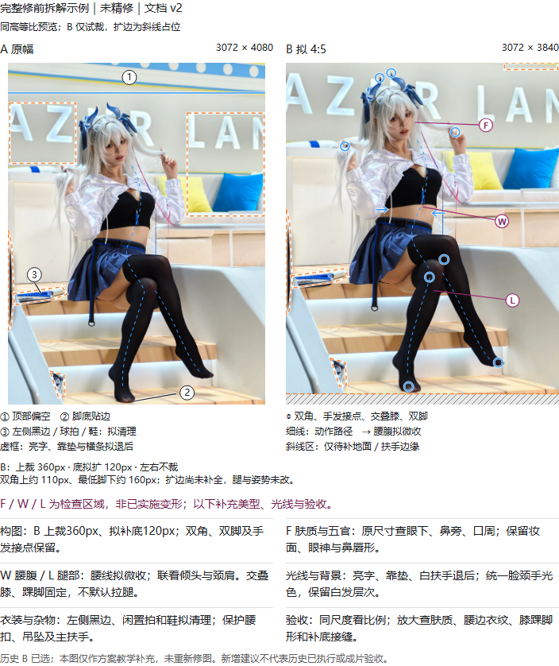
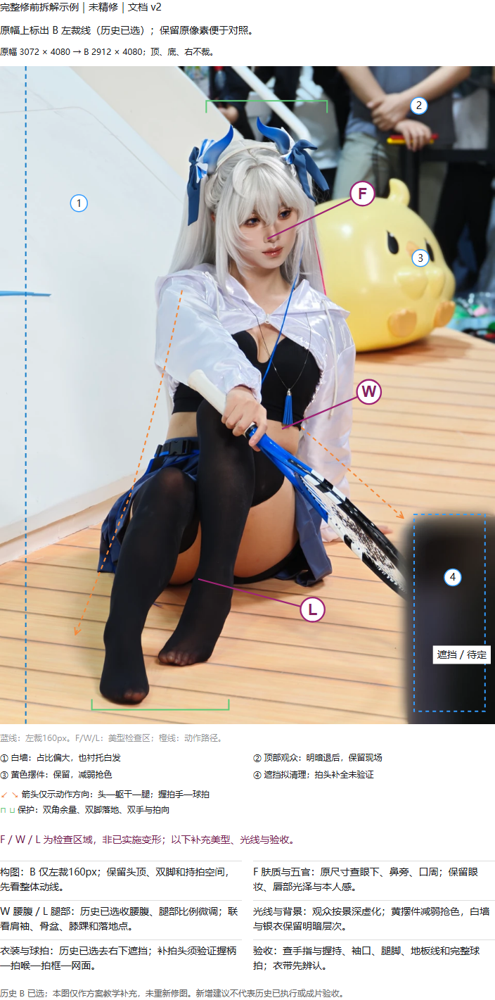

# natural-shaping · 自然美型

**人像精修与 Cosplay 修图 Skill for Codex · Portrait & cosplay photo retouching**

面向人像与 Cos 照的可移植修图技能：先拆解构图、展示原片标注草图，确认后再精修肤质、五官、身形、光线与背景。保留本人感、角色妆造、关节和道具结构，并主动检查修后瑕疵。

A Codex skill for **portrait retouching** and **cosplay photo editing**. It guides source-based composition sketches, identity-preserving refinement and visual quality checks, with **Photoshop ExtendScript (JSX)** helpers. Editing requires the tools available in your environment.

[安装与使用](#安装与使用) · [构图草图](#构图草图composition-sketches) · [10 张示例与版本状态](natural-shaping/assets/examples/README.md) · [完整流程](natural-shaping/SKILL.md)

## 能做什么

| 方向 | 工作内容 |
|---|---|
| 构图与沟通 | 分析留白、动作路径、画边与遮挡；给出可比较的原片草图，确认后执行 |
| 人像精修 | 分别判断肤质、五官、肩颈、腰腹及腿脚比例，保护身份和妆造 |
| 光线与背景 | 肤色与彩光衔接、按景深弱化路人、处理具体干扰并保留现场感 |
| 道具与验收 | 联看手、衣带、球拍等完整连接；查新增损伤、原尺寸细节与实际交付文件 |

包内提供方法、参考图和辅助脚本。修图效果取决于执行工具与实际验收；不包含像素蛋糕算法、Photoshop 软件或生图模型。

## 构图草图｜Composition sketches

以下是基于**精修前原片**的完整方案拆解示例：构图、肤质五官、肩颈腰腿、光线背景、衣装道具与验收一起说明。F/W/L 标出检查区域，照片未重新精修；历史已选方案与新增教学建议分别标明。

### 狩司司 114：裁顶与少量补底

比较 A/B 裁顶补底；同时拆解肤质五官、肩颈腰线、光色与杂物清理，保留交叠膝和脚形。

[](natural-shaping/references/composition-and-key-elements.md#狩司司-114-号用-ab-解释裁顶与少量补底)

### 狩司司 110：动线、遮挡与道具

联看白墙、观众与持拍动线；说明收腰腹、腿部比例、脸颈手光色，以及球拍结构验收。

[](natural-shaping/references/composition-and-key-elements.md#狩司司-110-号动线遮挡与道具补全边界)

点击图片阅读[完整拆解与取舍](natural-shaping/references/composition-and-key-elements.md#示例草图的制作与展示)。图片为静态方案示意；具体裁幅、调整范围与历史确认仅适用于对应照片。

## 安装与使用

下载或克隆本仓库，将整个 [`natural-shaping/`](natural-shaping/) 文件夹放入目标应用支持的技能目录，保持内部目录结构；不要只复制 `SKILL.md`。不需要另外安装原作者的其他修图 skill。首次使用先阅读[移植说明](natural-shaping/references/portability.md)，确认应用已识别技能，再用合成小图测试实际要用的执行路线。

在支持 `$` 调用的 Codex 环境中，可提供照片或文件夹并这样请求：

```text
$natural-shaping 请先拆解这张 Cos 照的构图，展示基于原片的方案草图。
等我确认后，再精修肤质、五官、身形、背景和光线，并保存到我指定的目录。
```

每张新图或完整重修，应先展示草图并等待确认。同一方案内的局部返修沿用已有确认。源图保持只读，照片、PSD 和预览保存在本次任务目录，不写入技能安装目录。

**Quick start:** Copy the complete `natural-shaping/` folder into the skill location supported by your application. Provide a photo and output directory, invoke the skill, review the composition sketch, then confirm the editing scope. See [portability and dependencies](natural-shaping/references/portability.md) before using the scripts.

## 工具与能力边界

- 看图诊断与验收需要文件读取、图像查看能力。
- 原生精修需要 Photoshop 及能够执行 ExtendScript 的连接。包内 runtime 提供曲线、颜色层、蒙版、预览和导出；没有自动身体识别或液化接口。
- 局部生成需要当前应用提供的图像编辑能力；不附模型、账户、密钥或固定生图型号。
- 交互对照依赖应用的可视化能力；没有时使用等尺度静态对照。
- PNG 检查需要 PowerShell；无损压缩需要 Python 3.11+。自动主体蒙版是可选功能，其环境和模型按[蒙版说明](natural-shaping/references/mask-tools.md)另行准备。

## 示例、资料与校验

[成片示例目录](natural-shaping/assets/examples/README.md)包含蕾姆、dora、宫本樱、群像、神里、知更鸟、爱莉希雅和三张狩司司，共 10 张指定版本 JPG。逐张区分用户认可、保存交付与待完善状态；历史失败局部见[cases 索引](natural-shaping/references/cases/README.md)。

在仓库根目录运行：

```sh
python natural-shaping/scripts/validate_portable.py
```

校验脚本检查文件清单、SHA256 和显式本地引用，不联网、不修图、不写包内文件。检查通过不代表图像效果或外部工具已验收；当前包内容以 `natural-shaping/package-manifest.json` 为准。

资料按问题读取，外部链接保留出处，不会每次重新访问全部网页或视频。教程观察与向 PS 迁移的判断分别记录，详见[像素蛋糕方法参考](natural-shaping/references/pixcake-cos-workflow.md)。
