# 三张脸分别看：群像的气色、构图与下沿

群像不能用一套增白、增红覆盖所有人。先保住三位完整成员，再分别看光线、唇色、颈肩与道具，最后检查画边补全的可信度。

[查看完整交互案例](https://yeliannaa.github.io/natural-shaping/group.html) · [第一次修一张](https://yeliannaa.github.io/natural-shaping/first-photo.html)

## 整体对照

保留三位脸部完整成员。终稿下沿含补全，整图展示与逐人细节分别检查，不能用一张脸的气色代表所有成员。 两图按同展示高度查看，未做像素对齐。

<table><tr><th>原片</th><th>终稿 111 v5</th></tr><tr><td>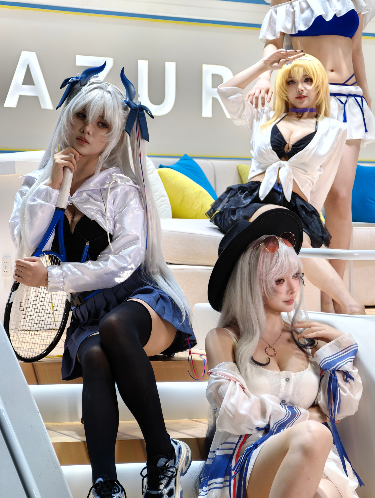</td><td>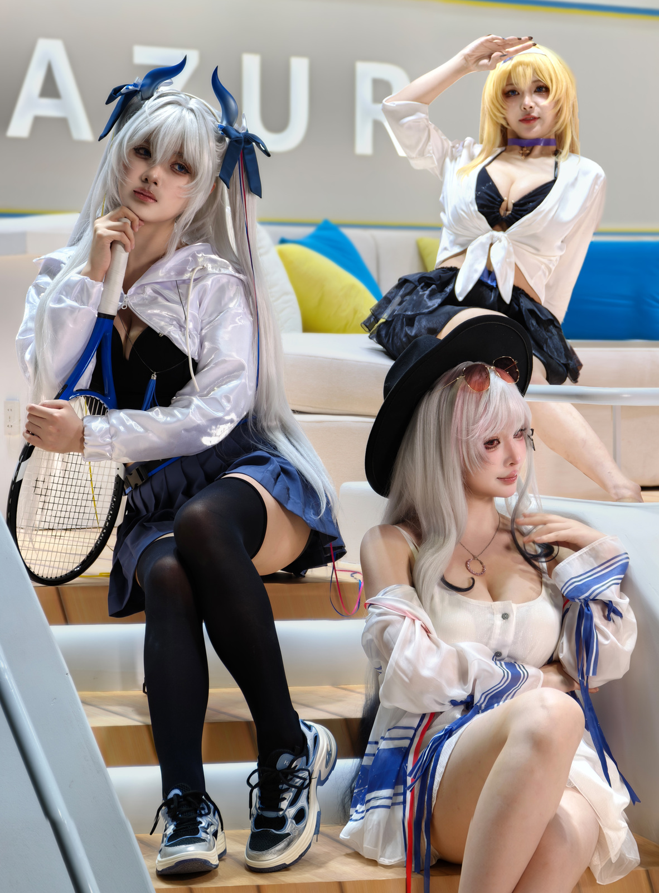</td></tr></table>

## 构图、美型与保护

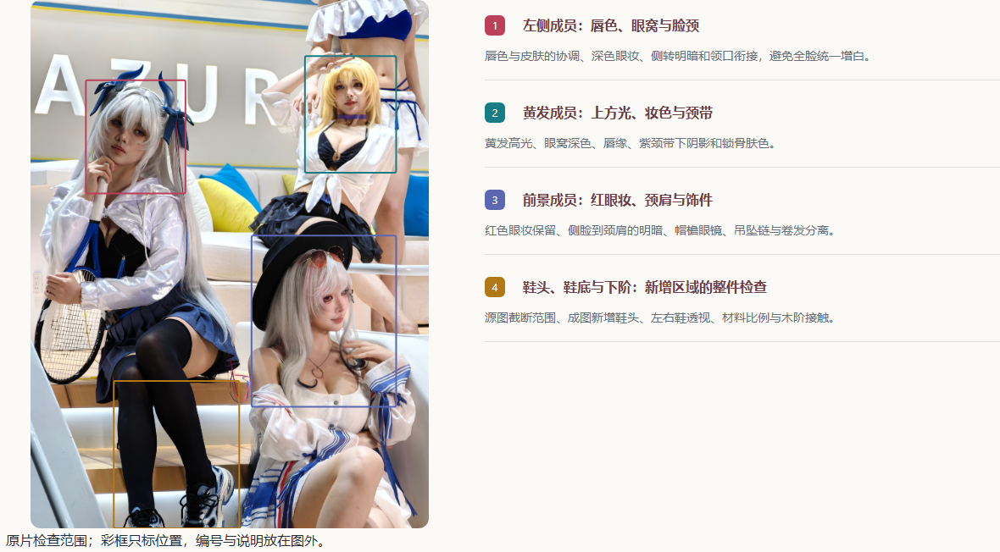

### 三张完整脸形成稳定的三角

**位置：** 左侧持拍成员、右上黄发成员、右下戴帽成员，以及原图右上无完整脸的身体片段。

**原片与终稿：** 原图：三张完整脸分居左中、右上和右下；右上另有一位只露衣装、躯干及腿部的成员，抬手附近还有她的手，叙事重心因此分散。 成图：画面围绕三位脸完整成员展开，头部形成三角。黄发成员抬起的手、左侧角饰与右下帽檐都保留了空间，左侧鞋头和下阶也更完整可见。

**观看影响：** 观者能先认清三个人，再顺着抬手、持拍和交叠腿浏览姿态；取舍避免把半个人体当作第四个视觉中心。

**处理与保护：** 人物选择是构图决策，应明确保留谁。上沿同时看抬手和角饰，下沿同时看鞋与台阶；移走不完整成员之后仍要检查衣发后方有没有残留肢体或破碎家具。

### 左侧成员：深唇色与眼窝要分开处理

**位置：** 银发持拍成员的双眼、鼻旁、嘴唇和下颌至颈部。

**原片与终稿：** 原图：银色刘海和头部侧倾使一侧眼窝更暗，唇色较深；脸与颈部受光和银色外套高光不同，不能把深色都归为皮肤问题。 成图：嘴唇呈较易读的红褐色，面部暗部仍能解释眼窝与侧转；刘海、蓝色瞳色和眼周深色没有被统一抹白。

**观看影响：** 唇色与周围皮肤协调后，表情更有气色；若把眼窝一起大幅提白，妆造和深浅关系会丢失。

**处理与保护：** 把唇色、眼周光色和脸颈衔接分别检查。记录中曾出现左侧唇色偏黑的漏检，公开教学应展示这一局部怎样看，而不是概括为全员已经提亮。

### 黄发成员：上方光与眼妆不能混成一片

**位置：** 右上成员的额头、鼻梁、眼窝、嘴唇、紫色颈带及锁骨。

**原片与终稿：** 原图：黄色假发受到明显上方光，面部中心较亮而眼窝保留深色眼妆；紫色颈带与白衬衣把肤色夹在不同材料之间。 成图：黄发仍明亮，眼窝与嘴唇仍独立可辨，颈带下方和锁骨处保留阴影，没有统一变成同一种亮白。

**观看影响：** 亮发与较深眼妆共同塑造角色；脸、颈和胸前若分成几块不同肤色，会让人误以为人物被分别拼接。

**处理与保护：** 从额头—脸颊—颈带下方—锁骨连续看，保留原妆、上方受光和衣领遮光。气色调整以她自己的光线为准，不能照搬左侧成员的唇色或亮度。

### 前景成员：红眼妆与肤色过渡都要保留

**位置：** 右下戴帽成员的刘海下眼周、唇缘、侧转下颌、颈肩和胸前吊坠。

**原片与终稿：** 原图：粉银假发、红色眼妆和侧转脸部构成前景重点，面部比肩臂更偏暖；帽檐与发丝遮挡颈侧，吊坠在锁骨下方。 成图：红眼妆、唇色与侧转仍可读，脸颈和肩部过渡更容易整体观看；帽檐、眼镜、卷发和吊坠都留在原有视觉关系里。

**观看影响：** 这位离镜头最近，稍微不一致的脸颈光色就会放大；过度磨皮则容易吞掉眼妆、唇缘和细发。

**处理与保护：** 联看面部、颈侧、裸肩与抬起的手，保持妆色与皮肤纹理。侧转与帽檐遮光决定的不对称，不自动当作脸型缺陷；吊坠链与卷发不能并成一条假线。

### 颈肩与腰部按各自衣装解释

**位置：** 左侧银外套领口、右上抬臂与衬衣结、右下落肩袖及背心腰部。

**原片与终稿：** 原图：左侧腰部主要由黑色内衣与裙摆遮住；右上白衬衣系结露出侧腰；右下外套落到上臂，背心与胸前卷发形成多层边界。 成图：三人的衣装层次仍可读：银外套有反光，白衬衣结有折叠，右下落肩袖仍围绕手臂下垂。

**观看影响：** 同样的收腰或缩肩方式会对三套衣装造成不同破坏。高光布料不应被当作肤色亮斑，松衣褶皱也不等于身体赘余。

**处理与保护：** 逐人联看头颈、肩臂、可见腰侧和衣料受力。只讨论实际可见的身体与软衣轮廓；保住衬衣结、领口、袖口和银色布料纹理，不从成图反推每人都做了相同几何调整。

### 腿脚与下沿补全要单独验收

**位置：** 左侧交叠黑袜腿与两只运动鞋、右上向右下延伸的裸腿、前景成员的交叠膝盖和下阶。

**原片与终稿：** 原图：左侧运动鞋在下沿被截去鞋头，右上裸腿斜着伸到扶手后方，前景膝盖突出且下方身体出框。黑袜有膝部体积，裸腿有真实明暗差。 成图：当前图能看到左侧两只完整鞋头和更多下阶；交叠黑袜腿、右侧后方裸腿及前景膝盖仍呈不同空间方向。

**观看影响：** 完整鞋头能改善画边的局促感，但补全也引入鞋型、透视和台阶材质的验证负担；群像的腿不能仅按画面中可见长度统一拉直。

**处理与保护：** 把当前新增鞋头与原有鞋身、鞋底、鞋带、地面接触一起看，检查左右鞋透视与材料尺度；未知鞋头结构保留推断说明。历史 v2 撤回下扩不等于当前 v5 的全图认可，也不能作为所有新图都要补鞋的默认理由。

### 球拍、饰件和手势共同定义人物

**位置：** 左侧靠下巴的握拍手、下方扶拍手、拍柄至网面；蓝角、帽檐眼镜和三人的手指。

**原片与终稿：** 原图：左侧一手靠下巴握住拍柄，另一手扶着拍颈，长拍框与网面顺着身体斜下；黄发抬手和前景抚发手分别构成上、下动作。 成图：拍柄、拍颈、拍框和网面仍连续，蓝角仍附在发型上，前景帽檐与眼镜的叠放关系可辨；三种手势保持区分。

**观看影响：** 道具与手势比单独脸部更能交代角色。拍框一处弯折、手柄脱手或饰件悬空，会破坏全图可信度。

**处理与保护：** 把拍子作为整件道具检查前后缘、直线、网格与握持关系；逐手看手指数量、方向和袖口。发带、衣带与腿后附件先识别再决定，不能按杂物统一删除。

### 背景弱化仍要保持沙发与扶手连续

**位置：** 大字母背景、蓝黄靠垫、白沙发、右侧横扶手及左下斜立结构。

**原片与终稿：** 原图：字母、亮白沙发、蓝黄靠垫和几条白色结构线紧靠人物；原图不完整成员的手与躯干交叠在右上背景里。 成图：字母与靠垫较柔，人物分层更清楚；蓝黄场景色仍保留，白扶手和沙发在三人身后继续提供空间关系。

**观看影响：** 把背景压弱能让三张脸更易读，家具断线、白色残片或过强重复补片仍会抢眼；蓝黄颜色保留了现场特征。

**处理与保护：** 沿扶手、沙发边和台阶检查整段结构，同时看头发、袖缘与背景交界。记录中的供体残片与旧虚化层依赖说明：只修一个补片不一定能消掉成图残留，最终应以实际展示图复看。

## 四组局部特写

局部从原尺寸素材分别裁取；显示大小与裁取范围不同，不作为像素对齐或幅度测量证据。

### 左侧成员：唇色、眼窝与脸颈

<table><tr><th>原片</th><th>终稿</th></tr><tr><td>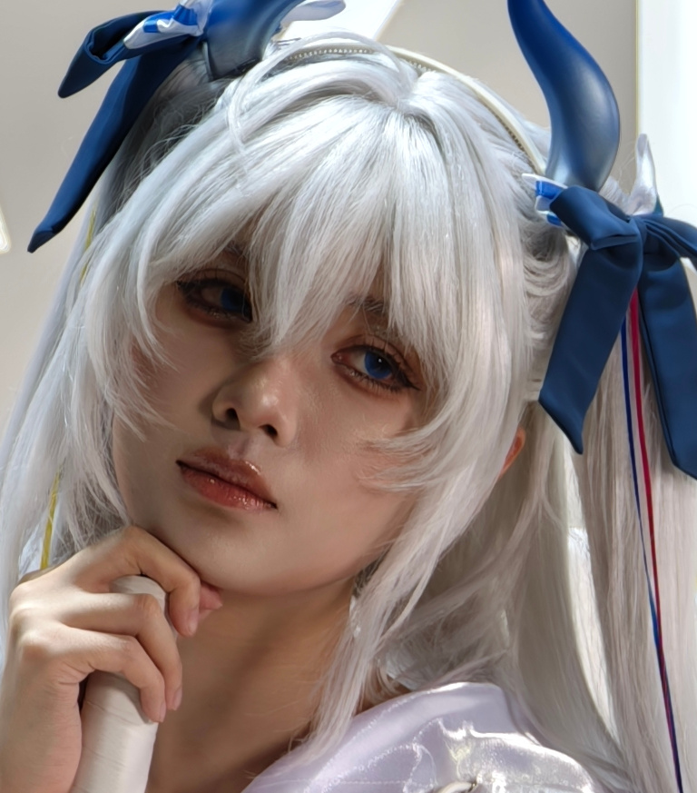</td><td>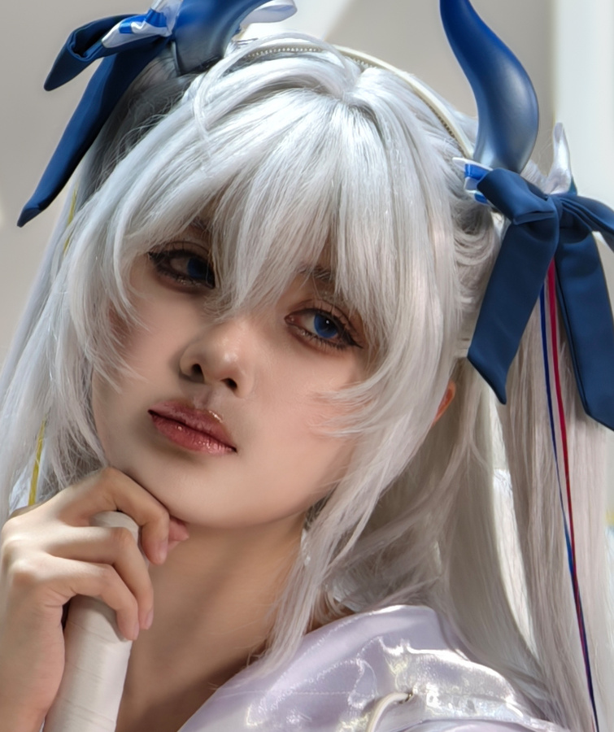</td></tr></table>

唇色与皮肤的协调、深色眼妆、侧转明暗和领口衔接，避免全脸统一增白。

### 黄发成员：上方光、妆色与颈带

<table><tr><th>原片</th><th>终稿</th></tr><tr><td>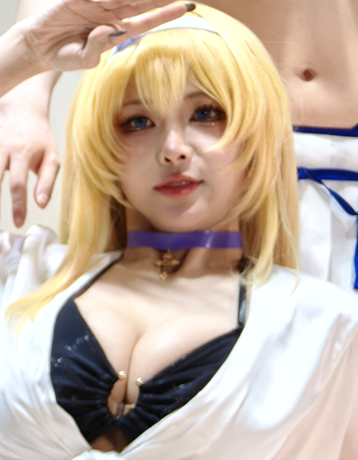</td><td>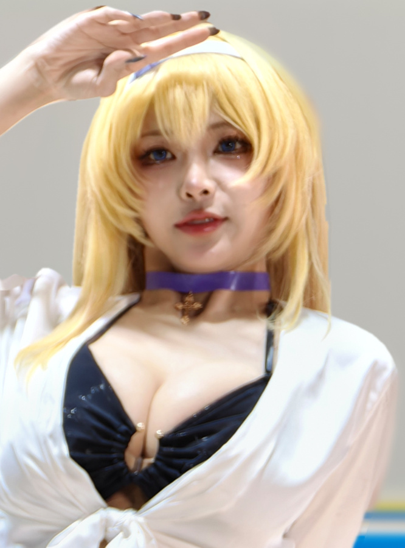</td></tr></table>

黄发高光、眼窝深色、唇缘、紫颈带下阴影和锁骨肤色。

### 前景成员：红眼妆、颈肩与饰件

<table><tr><th>原片</th><th>终稿</th></tr><tr><td>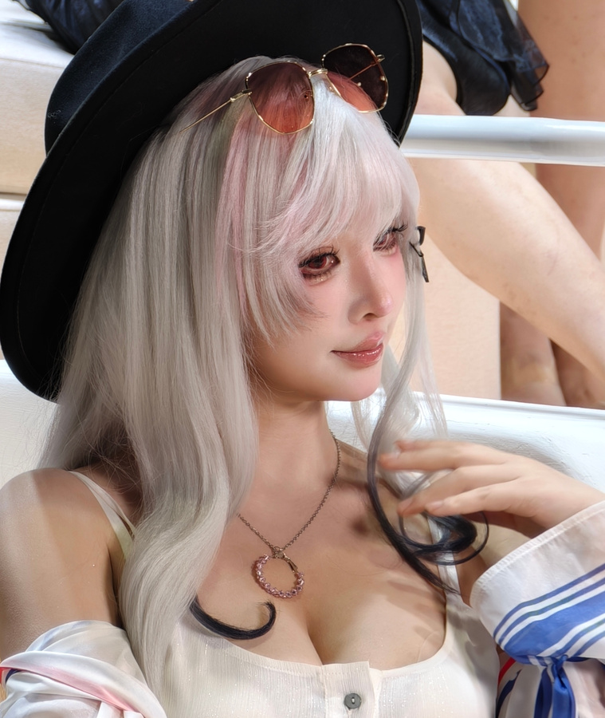</td><td>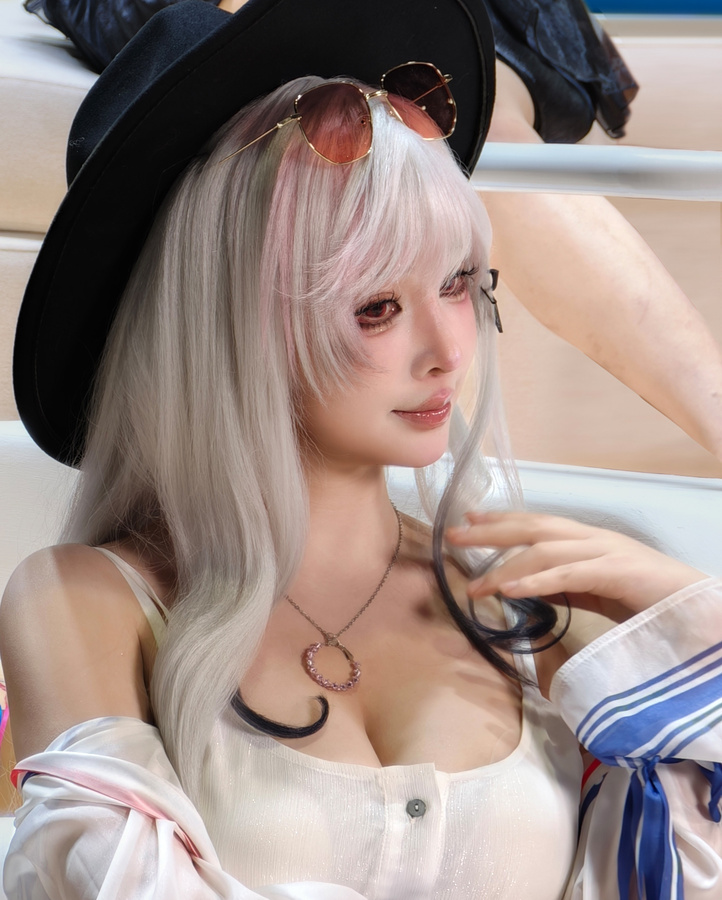</td></tr></table>

红色眼妆保留、侧脸到颈肩的明暗、帽檐眼镜、吊坠链与卷发分离。

### 鞋头、鞋底与下阶：新增区域的整件检查

<table><tr><th>原片</th><th>终稿</th></tr><tr><td>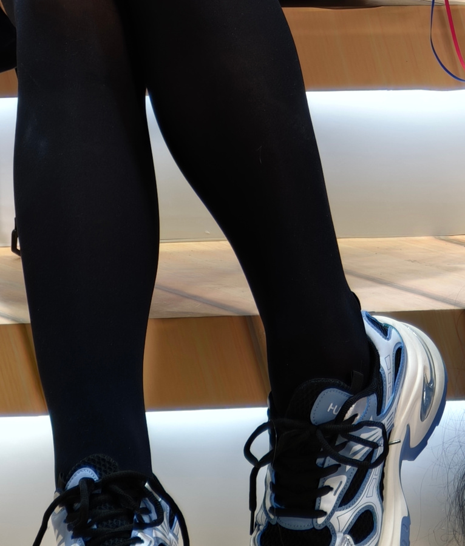</td><td>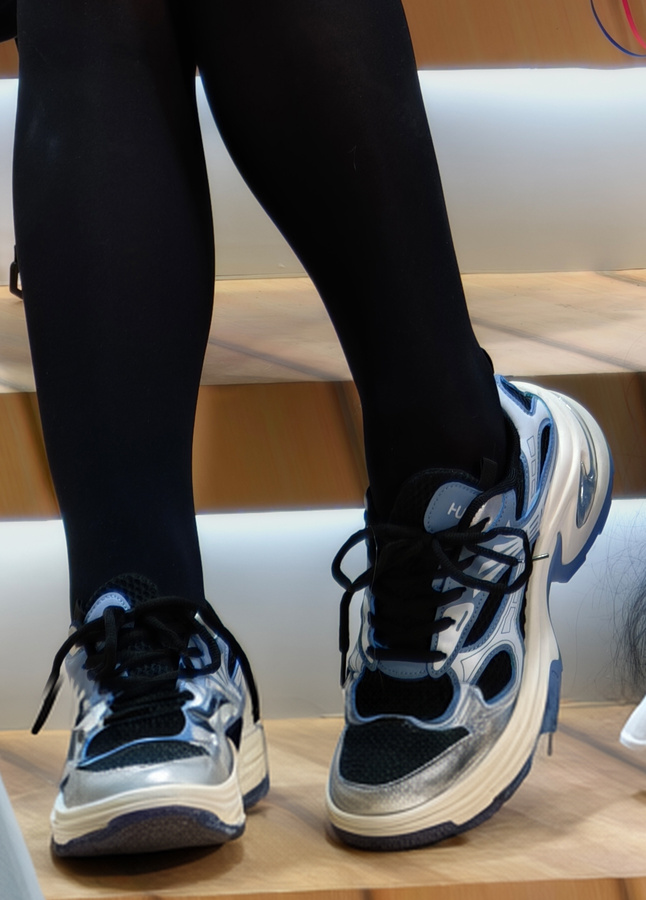</td></tr></table>

源图截断范围、成图新增鞋头、左右鞋透视、材料比例与木阶接触。

## 验收重点

- 适屏能清楚读到三张完整脸的三角关系，抬手、角饰和帽檐不被随意截断；移走不完整成员后没有残留肢体或家具断线。
- 分别放大三张脸，检查各自唇色、眼窝、妆色及脸颈衔接；不以同一种亮白或红唇作为全员通过标准。
- 整件检查球拍与双手，联看帽檐眼镜、颈带、吊坠和袖口；饰件位置和衣料受力关系仍成立。
- 单独验收鞋头与下阶补全，保留未知结构的说明；当前保存或收录状态不得写成独立全图认可，也不得混用早期撤回记录。

## 示例版本

示例索引将群像 111 v5 列为当前最新版、按案例提供者要求收录，参考重点包括逐人气色、唇色与下沿补全。

未据收录补写 v5 的独立全图认可。NS12 关于撤回下扩、气色交付与未获全图认可的叙述指向较早 v2，不应直接当作 v5 的当前操作或接受状态。

图像观察与教学判断不替代每处实际文件验收；资料见[案例记录](../natural-shaping/references/personal-cases.md)。
