# 从纸箱夹缝到完整坐姿：蕾姆的场景与人物一起收尾

先读懂探身、握相机、屈膝前伸的动作，再处理遮挡、彩光与人物细节。真正值得学习的是整条连接都成立，而不只是脸变亮。

[查看完整交互案例](https://yeliannaa.github.io/natural-shaping/rem.html) · [第一次修一张](https://yeliannaa.github.io/natural-shaping/first-photo.html)

## 整体对照

原片纸箱遮挡了人物和衣装；终稿同时重构背景。对照展示的是整体取景与成片观感，新增部分包含推断。 两图按同展示高度查看，未做像素对齐。

<table><tr><th>原片</th><th>终稿 v21</th></tr><tr><td>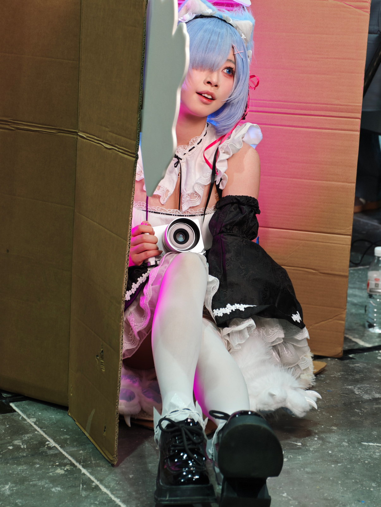</td><td>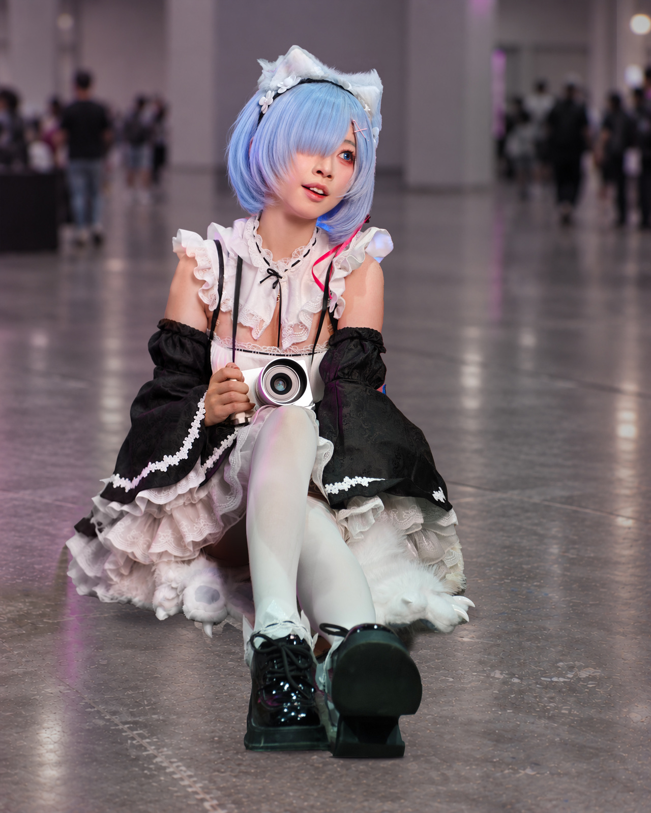</td></tr></table>

## 构图、美型与保护

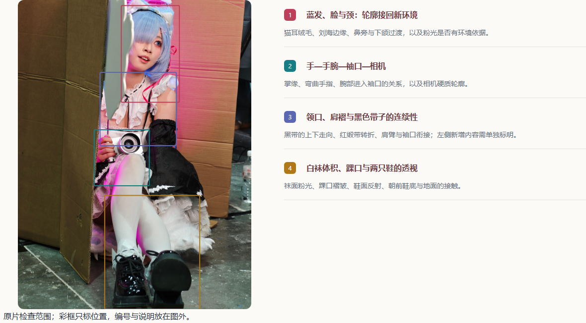

### 构图先保住完整坐姿

**位置：** 全图；原图左侧纸箱、头顶和下沿鞋底，成图的头顶留白与鞋前地面。

**原片与终稿：** 原图：人物被纸箱夹在画面中右部，猫耳顶端贴近或越过上沿，前伸的鞋底逼近下沿；左侧大面积纸板比脸和动作更抢眼。 成图：人物回到画面中部，头顶、两侧裙摆和鞋前都能读到空间。猫耳至鞋底约占画面高度九成，仍有坐姿的分量，不会缩成背景里的小人。

**观看影响：** 视线可以从蓝发与露出的眼睛，沿相机、屈起的膝盖走到前伸鞋底，动作路径完整；纸箱原有的窥探情境也因此变成开阔的展馆坐姿。

**处理与保护：** 先决定是否接受这种场景与叙事变化，再谈美型。保留前脚鞋底较大的透视关系；新增左右空间与隐藏衣装属于推断，不能宣传成真实恢复。

### 脸部精致感来自光影与辨识点

**位置：** 露出的眼睛、鼻旁、嘴角、下颌至颈部；刘海遮住的另一只眼。

**原片与终稿：** 原图：露出的蓝色眼睛、张开的唇形和侧倾头部是表情中心，左侧面颈有明显粉色光，鼻旁与下颌受现场明暗影响。 成图：蓝色瞳色、唇形、头部侧倾和遮眼刘海仍可辨；面颈光色较连贯，嘴角、下颌与颈侧的暗部仍在。

**观看影响：** 人脸更容易成为第一落点，皮肤不必靠统一磨白才能显得干净；保留鼻孔、唇缘和颈侧暗部才能解释体积。

**处理与保护：** 联看脸与颈，区分粉光、妆面和真实结构。两图取景与人物位置变化较大，不能从展示尺寸直接反推瘦脸幅度，也不应补出被刘海遮住的眼睛。

### 蓝发与猫耳要接成完整材质

**位置：** 刘海末端、脸颊外侧发束、猫耳之间及肩旁发尾。

**原片与终稿：** 原图：顶部毛耳贴边，左侧灰色前景板切到发型；右侧粉色灯光与蓝发相遇，发缘有很强的色彩对比。 成图：猫耳、头箍花饰、刘海和两侧发束都能连读，短发边缘与耳毛面对的是新的灰紫展馆背景。

**观看影响：** 发型整体比单根发丝更决定角色辨识；一条僵直发缘或孤立亮边会立即暴露人物与背景的脱节。

**处理与保护：** 同时看轮廓、发束内部与相邻背景。蓝发应保留细丝与层次，猫耳应保留绒毛；不要用过度锐化制造硬切面，也不要把所有现场彩光一概删去。

### 肩臂轮廓必须接回袖装

**位置：** 两侧裸露上臂、黑袖上缘、白色肩褶与颈部蕾丝领。

**原片与终稿：** 原图：右侧上臂和袖口可见，左肩及大片左袖被前景挡住；白色肩褶、领口和黑袖各有不同的明暗。 成图：两侧肩臂完整可读，黑袖仍在上臂处收束，白肩褶围绕肩部起伏，颈下蕾丝没有变成一片平白。

**观看影响：** 上臂再细，若袖口与手臂错位或肩褶悬空，人物仍会显得不真实；双侧可见后更容易检查头、颈、肩的整体比例。

**处理与保护：** 把肩下、臂外侧、袖口两端一起验收，保留自然凸度和衣料厚度。原图被挡住的一侧只能作为重建区评价，不能拿它证明原本的身体轮廓。

### 相机握持要连着手腕与袖口看

**位置：** 相机左侧的握持手、掌下手腕、相机下缘及黑袖白蕾丝口。

**原片与终稿：** 原图：手指弯曲包住机身侧面，掌缘紧邻纸箱；腕部向下进入黑袖和白蕾丝，镜头正面是硬质圆形。 成图：纸箱不再挡住掌缘，握持手、腕部和袖口更完整可见；相机仍贴着屈起的腿，镜头与机身保持硬质边界。

**观看影响：** 这组连接给相机重量和支撑感。掌缘接缝、断腕、袖口不对位或镜头变椭圆，都会比细小肤色问题更抢眼。

**处理与保护：** 按指尖—指节—掌缘—腕部—袖口—机身逐段检查，保护原有弯指动作及镜头几何；不能只清理纸箱而忽略露出的连接，也不能因肤色统一把关节层次抹掉。

### 黑色带子与红缎带各有去向

**位置：** 领口下方黑色细带、两侧向相机下垂的黑带，右肩旁红色缎带。

**原片与终稿：** 原图：胸前有多条黑色带状结构，红缎带绕过右侧发尾与肩褶；部分起点受遮挡，不能只凭颜色把它们当杂线。 成图：黑带在白色衣料上仍清楚可读，红缎带仍从肩旁向胸前转折；领口、肩褶、带子和相机形成连续的上下关系。

**观看影响：** 带子的连接解释衣装和道具的支撑；一段被擦掉、厚度突变或无来源穿过手臂，会破坏完整感。

**处理与保护：** 分别追踪衣装黑带、相机附近的带子和红缎带，确认可见段没有断裂或突然换宽。起点被遮住时保留不确定性，不凭空认证隐藏锚点，更不要按黑色统一删除。

### 腿部比例与鞋透视分开判断

**位置：** 相机下方屈膝、白袜小腿、两侧踝口、前伸的黑鞋及裙摆毛边。

**原片与终稿：** 原图：白袜接到一条朝镜头前伸的腿，另一只鞋以鞋底朝前；膝、小腿和袜面有很亮的粉光，左侧裙摆大片被挡住。 成图：白袜明暗更温和，两只鞋的不同朝向仍保留；裙摆蕾丝、白色毛边、踝口与鞋面能一起读到。腰部大多藏在相机、手与层叠衣料后。

**观看影响：** 屈膝和鞋底的透视带来坐姿的空间感；把两条腿修成等长、把袜面抹成白柱，反而会失去动作和材质。

**处理与保护：** 检查膝—小腿—踝—鞋的连续线与高光，保留袜面的体积和鞋底透视。腰部只讨论可见衣料，不把隐藏腰线写成已恢复，也不把取景变化造成的修长观感当成拉腿证据。

### 新背景要承接人物原有光色

**位置：** 发缘、左右肩、袜面与裙边的彩光，地面反射和两侧远处人群。

**原片与终稿：** 原图：纸箱、灰色前景和硬地面构成拥挤现场，粉色灯光在发、面颈、袜面与白蕾丝上都很显眼。 成图：背景变成有纵向结构、远处人群与反光地面的展馆；彩光整体减弱，地面仍留有柔和的紫粉反射，人物与脚下环境的色温更接近。

**观看影响：** 背景弱化让细节成为主角，但人物边缘若仍有无来源的粉色描边，场景融合就会失败；鞋下接触关系决定人物是否像坐在地上。

**处理与保护：** 按皮肤、蓝发、白袜、黑袖和地面各自的材质检查彩光，不做同一种消色。适屏检查背景大色块和纵线，局部检查发缘、裙边与鞋下，保留合理的现场人群深度。

## 四组局部特写

局部从原尺寸素材分别裁取；显示大小与裁取范围不同，不作为像素对齐或幅度测量证据。

### 蓝发、脸与颈：轮廓接回新环境

<table><tr><th>原片</th><th>终稿</th></tr><tr><td>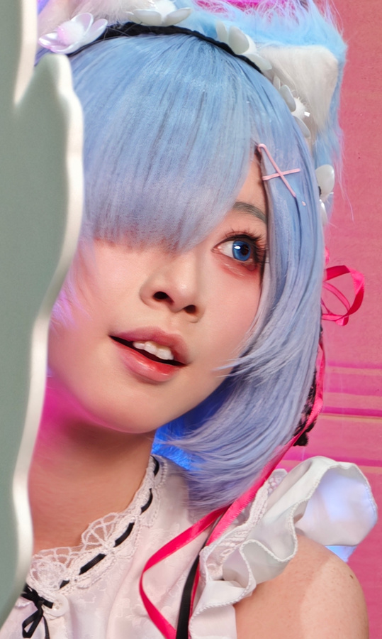</td><td>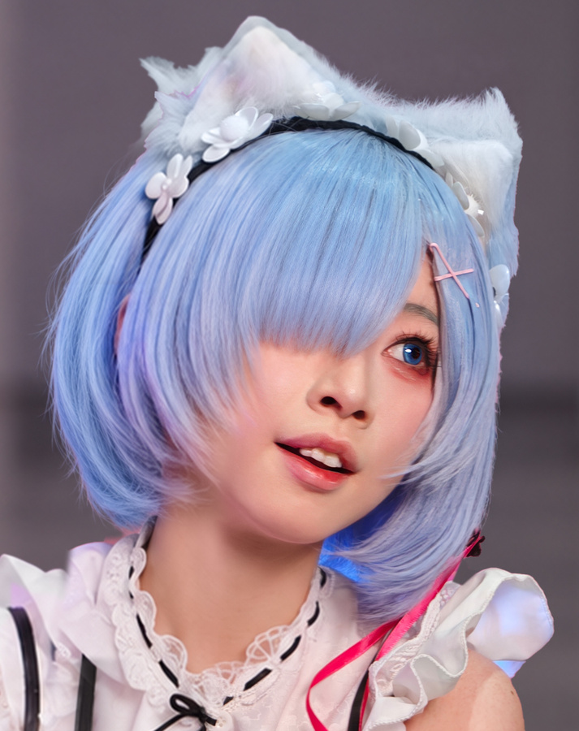</td></tr></table>

猫耳绒毛、刘海边缘、鼻旁与下颌过渡，以及粉光是否有环境依据。

### 手—手腕—袖口—相机

<table><tr><th>原片</th><th>终稿</th></tr><tr><td>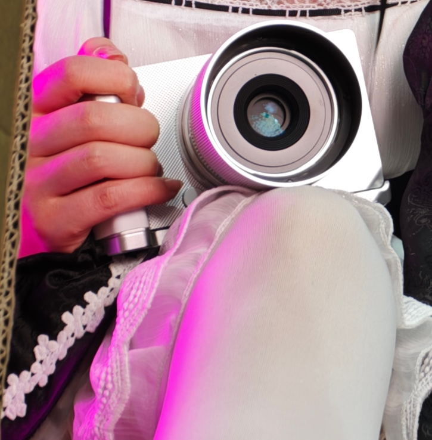</td><td>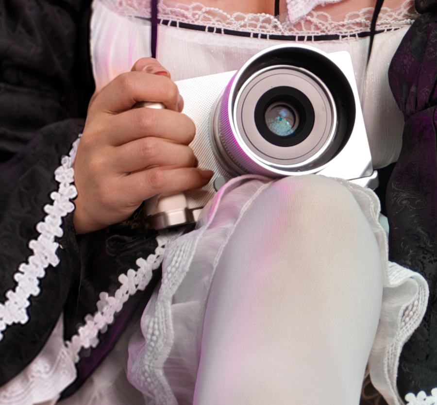</td></tr></table>

掌缘、弯曲手指、腕部进入袖口的关系，以及相机硬质轮廓。

### 领口、肩褶与黑色带子的连续性

<table><tr><th>原片</th><th>终稿</th></tr><tr><td>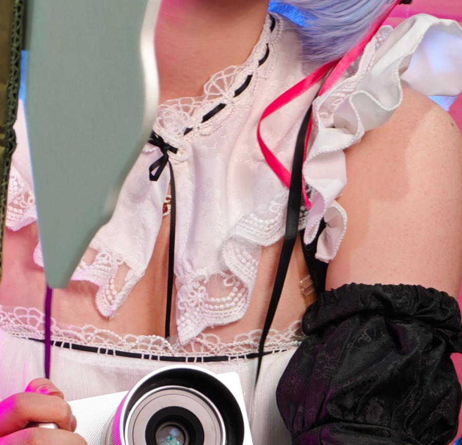</td><td>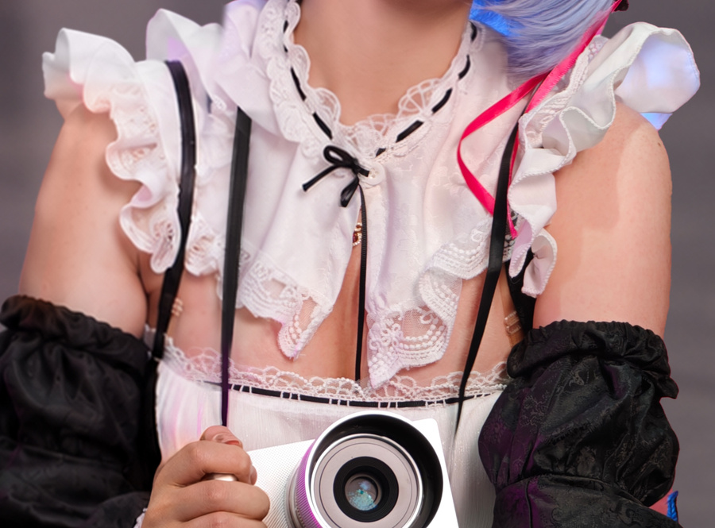</td></tr></table>

黑带的上下走向、红缎带转折、肩臂与袖口衔接；左侧新增内容需单独标明。

### 白袜体积、踝口与两只鞋的透视

<table><tr><th>原片</th><th>终稿</th></tr><tr><td>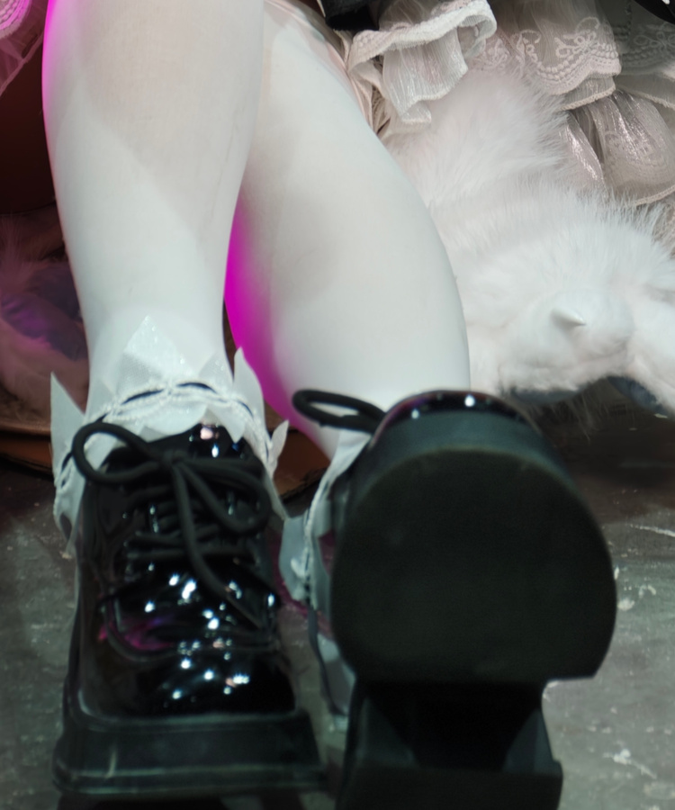</td><td>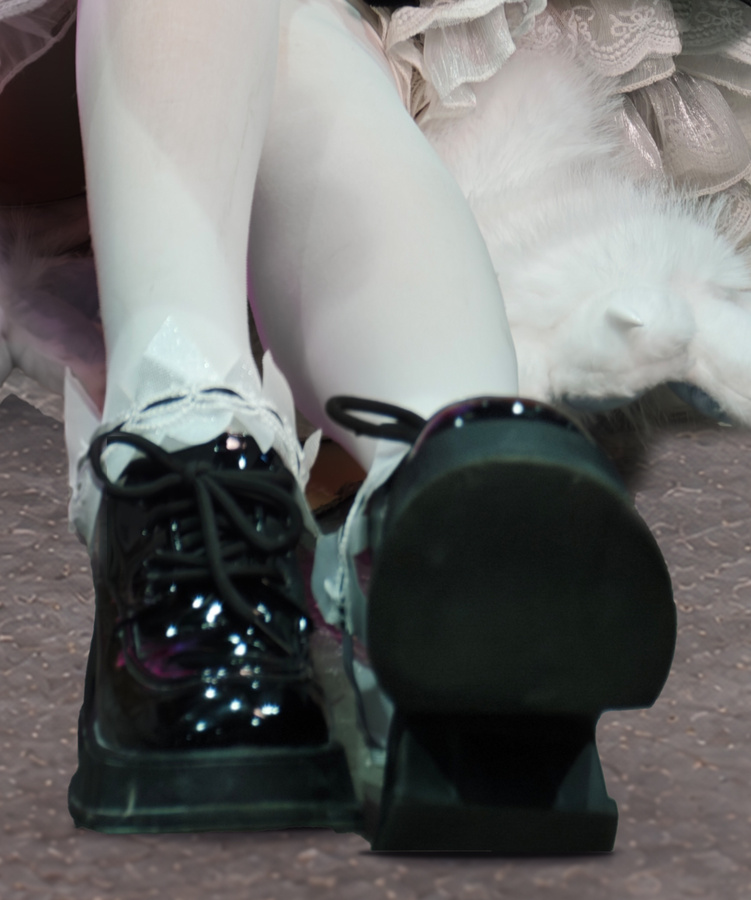</td></tr></table>

袜面粉光、踝口褶皱、鞋面反射、朝前鞋底与地面的接触。

## 验收重点

- 适屏看完整猫耳、坐姿和双鞋，头顶与鞋前有呼吸空间；相机—膝盖—前伸鞋底的动作路径能一眼读懂。
- 放大看脸颈与发缘：妆面、唇缘和发丝仍可辨，彩光不形成无来源的描边，背景没有硬切或孤立色块。
- 逐段看握持手、手腕、袖口、相机与胸前黑带：关节和硬质轮廓正常，可见带段连续，遮挡处不冒称真实恢复。
- 联看袜面、裙摆、踝口和地面：保留体积、蕾丝与鞋透视；新增衣装和场景范围透明说明，整体认可不替代局部复看。

## 示例版本

示例索引将蕾姆 v21 列为当前最新版；个人案例 NS04 将该图称作用户确认的当前效果。

本页展示当前图像的可观察外观，不把认可写成每处细节均无缺陷。纸箱遮住的肩袖、裙摆与背景不是原图中可直接验证的内容。

图像观察与教学判断不替代每处实际文件验收；资料见[案例记录](../natural-shaping/references/personal-cases.md)。
