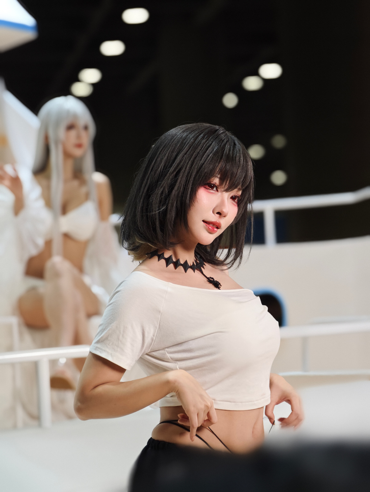
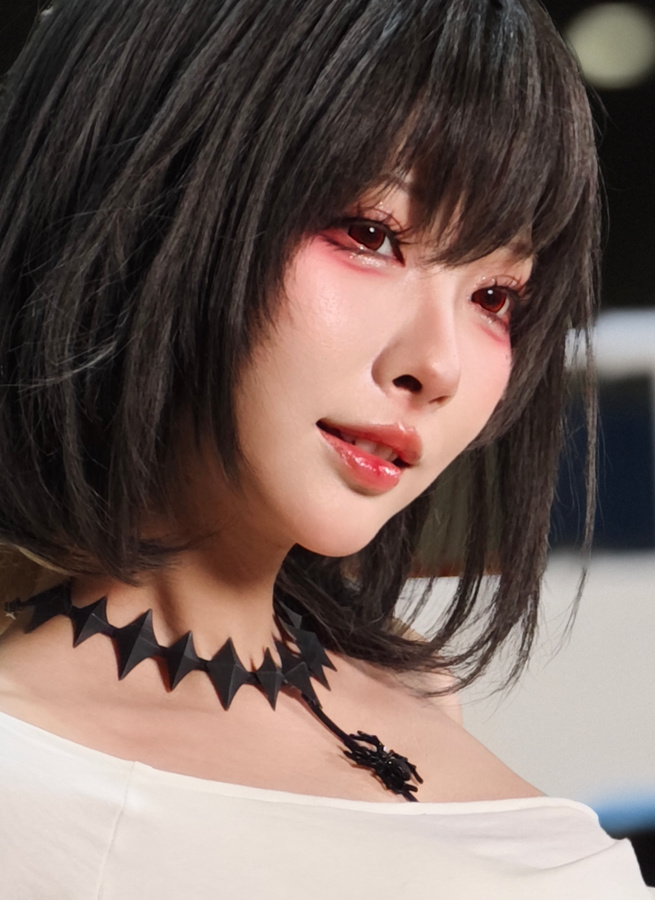
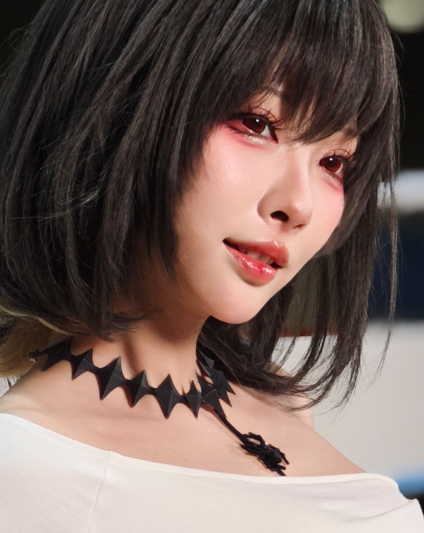
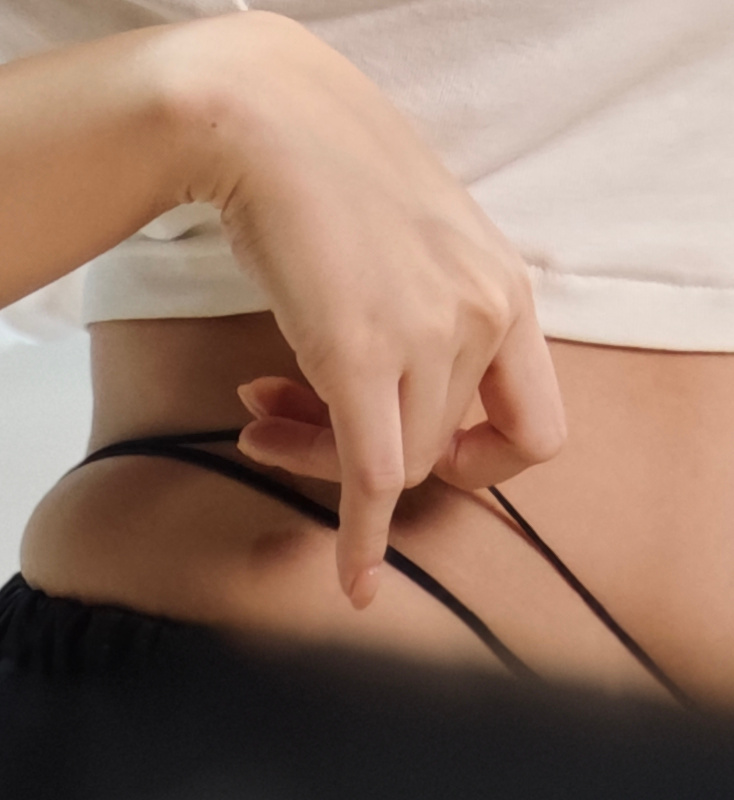
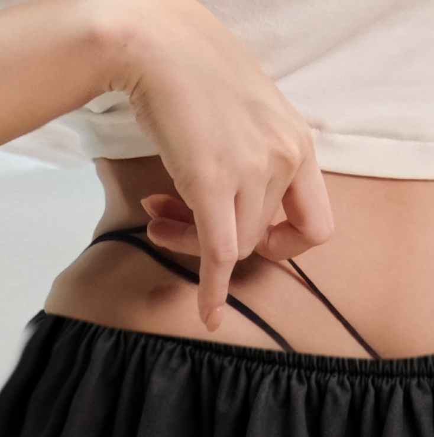
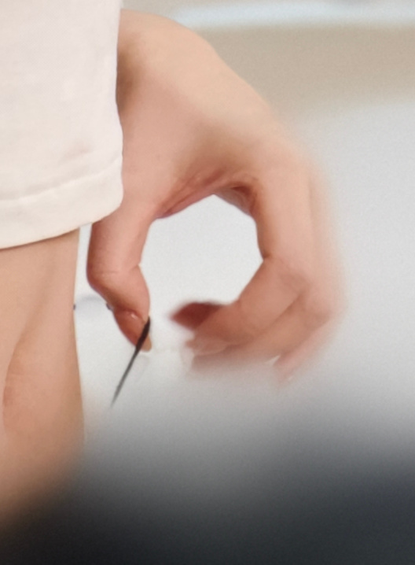
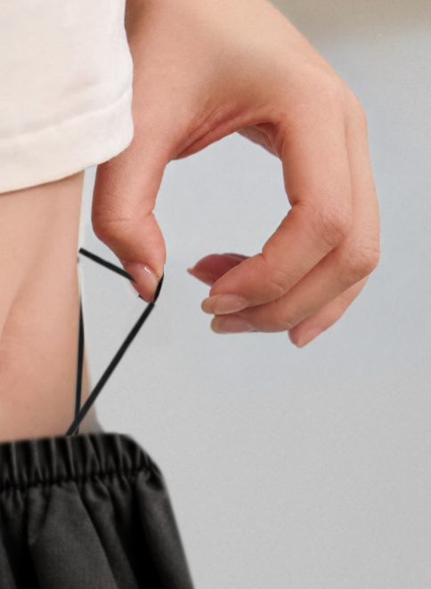
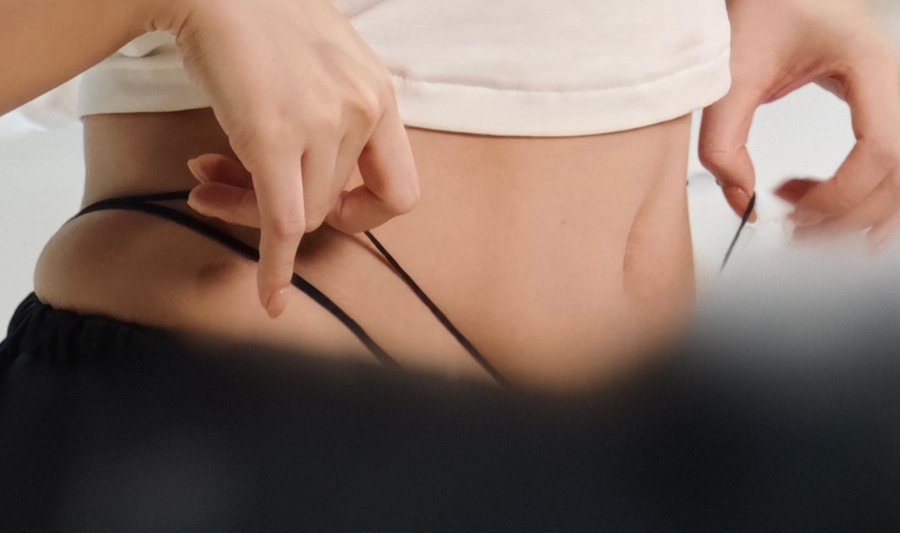
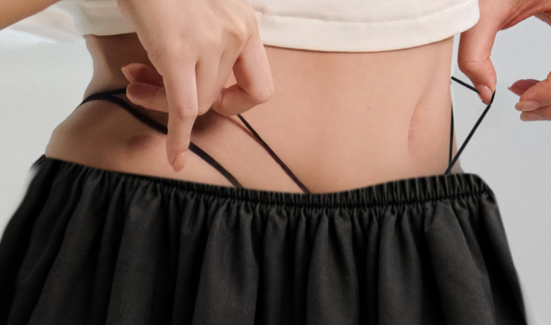

# 衣带必须能受力：宫本樱的双手—双带—腰头

这张图最值得学习的不是简单去掉遮挡，而是把双侧双带、手指、皮肤接触与衣缘逐段接好。构图、美型和材料真实感必须放在同一条检查链上。

[查看完整交互案例](https://yeliannaa.github.io/natural-shaping/sakura.html) · [第一次修一张](https://yeliannaa.github.io/natural-shaping/first-photo.html)

## 整体对照

取景更靠近人物，下方前景遮挡被补全。双侧衣带不按画面像素强行对称，连接要结合侧转姿态与真实参考理解。 两图按同展示高度查看，未做像素对齐。

<table><tr><th>原片</th><th>终稿 v9</th></tr><tr><td></td><td></td></tr></table>

## 构图、美型与保护

### 收紧上方空间，同时完整交代腰头

**位置：** 头顶空黑背景、腰腹与下沿黑色前景遮挡，成图完整可见的松紧腰头。

**原片与终稿：** 原图：头顶上方有较大黑色天花板与散景灯点，主体脸部在画面中部；下方黑色前景挡住大部分腰头及手下方衣带。 成图：头脸与上身在画面中的占比更大，脸进入上半区；上方空隙收紧，下方可见完整腰头与裙料。双手到腰头的动作不再被黑前景截断。

**观看影响：** 人物与手带动作成为同一个视觉中心；画内遮挡被移走后，新增内容必须承担真实连接的检查，不能只因画面更满就说已完成。

**处理与保护：** 分清裁剪、画内去遮挡与未知区域重建。保留脸朝右侧转和双手向腰侧牵带的路径，新增腰头及衣料明确视作推断；腿不在画面内，不作腿部美型评价。

### 脸部保留侧转、红妆与露齿唇形

**位置：** 刘海下双眼、红色眼妆、鼻旁、唇缘、侧脸下颌和发尾。

**原片与终稿：** 原图：黑短发包住侧转的脸，红色眼妆与亮唇是辨识点；两侧脸宽因角度和发丝遮挡而不同，面部明暗也不对称。 成图：侧转、红妆与露齿唇形仍清楚，眼下、鼻旁和下颌能读出平滑但有体积的过渡，发丝没有被整片涂黑。

**观看影响：** 精致感来自细节可读与光影连贯；把红妆当泛红去掉、把两侧脸修成对称，会削弱角色与表情。

**处理与保护：** 眼妆、鼻孔、唇缘和下颌边界分别保护。展示图人物大小变化明显，不据裁图比例推断具体瘦脸量；对侧转造成的不对称先解释机位与遮挡，再决定是否需要调整。

### 颈肩与尖角颈饰一起决定比例

**位置：** 黑发下颈侧、尖角黑颈饰、锁骨、斜向白领口及两侧肩部。

**原片与终稿：** 原图：短发与颈饰形成深色边界，肩线受侧转影响，白领口斜着跨过锁骨并在右侧形成衣褶。 成图：尖角颈饰仍有清楚轮廓，颈侧暗部、肩部亮面与斜领口继续互相解释；没有把颈饰和衣缘混成同一条黑白分界。

**观看影响：** 颈部长度与肩部宽度要靠头、发尾、领口一起看，单独柔化一块阴影不能证明比例协调；颈饰尖角是需要保护的硬边。

**处理与保护：** 联看头—颈—肩的侧转关系，保留发下阴影与领口真实斜度。保护颈饰各个尖角、吊饰与皮肤之间的间隔，不默认拉长颈部或把双肩修平。

### T恤下缘与腰腹不能分开收窄

**位置：** 胸下衣褶、两手上方衣缘、裸露腰腹、侧腰与黑色松紧腰头。

**原片与终稿：** 原图：白T恤的横斜褶皱指向侧腰，下缘压在手指附近；裸腹下方被前景遮住，源图只能确认部分腰侧与衣带。 成图：T恤下缘、裸腹、侧腰到松紧腰头完整可见，裙料由腰头向下形成褶皱，衣料和腹部仍有明暗起伏。

**观看影响：** 衣褶、手指与腰头共同解释体积；若只收腹部中段，衣缘和带子会留下失去支撑的折线。

**处理与保护：** 以连续的衣缘—皮肤—腰头检查可见腰部，保护衣料折叠与身体自然起伏。历史记录中新增腹部和衣料属于推断；保留这一边界，不把更完整的画面当作真实身体恢复。

### 画面左侧双带：贴肤、转折与手指压点

**位置：** 画面左侧下垂手指下方、侧腰到下方腰头的两条黑带。

**原片与终稿：** 原图：两条黑带在侧腰形成不同方向的可见线段，经过下垂手指附近后向下延伸；下端部分进入黑色前景遮挡，落点不完整。 成图：两条带的可见方向、手指压点与腰头关系更完整，贴肤段与斜向下段可以分别追踪，不是一条随意画在腹部上的线。

**观看影响：** 带子的转折要受手和腰部支撑，否则即使位置相近也会像描线；粗细、清晰度突然变化会暴露补全接缝。

**处理与保护：** 从每条可见起段，经指边转折到腰头逐条检查。贴肤段只需要窄而自然的接触关系，悬空段不统一加阴影；保持两带独立，不以等间距、等宽和平行作为正确标准。

### 画面右侧双带：侧腰落点与悬空受力

**位置：** 画面右侧拇指与食指夹持处，短上段、向侧腰下落的带段及腰头附近接点。

**原片与终稿：** 原图：右侧手指周围有运动虚影，黑带的可见段不完整，下方又与前景黑块相遇，难以一次看清全部连接。 成图：夹持处、向侧腰下落的带段和腰头更易分开读到；两侧受姿态影响，投影并不完全对称。

**观看影响：** 右侧一小段材质不真实，会拖累已经成立的整体结构；对称复制左侧带形，反而可能把锚点拉到错误位置。

**处理与保护：** 记录事实是 v8 借同套衣装多视角参考把右带落点放回侧腰，v9 锁定位置再改善材质。教学应分别看位置、粗细、边缘和接触；隐藏缝合点仍未知，不以两侧像素距离相等认证。

### 手指清晰度不能只靠重画边线

**位置：** 画面左侧向下伸出的指尖及其余弯指，画面右侧夹带的指腹、指甲、腕部。

**原片与终稿：** 原图：左手下垂指与其余弯指叠放，右手有真实运动虚影；手指附近同时有衣料、皮肤与细黑带，边界密集。 成图：双手形状较易读取，左侧下垂指仍指向带子，右侧夹持姿态仍围绕黑带形成空隙。

**观看影响：** 手指决定带子的受力，锐利外轮廓却缺少指节和指腹过渡会变成塑料手；手部模糊也可能来自拍摄而非新增修图。

**处理与保护：** 分别检查指尖、指甲、指腹、指缝、腕部与衣缘，保持自然叠放与关节。轻量展示图只支持可见范围判断，不能替每根指节做像素级认证，也不能把原有运动虚影一律归咎于处理失败。

### 保留景深，让人物与背景自然分离

**位置：** 左侧失焦白发人物、头顶散景灯、白扶手横线、黑发与白T恤边缘。

**原片与终稿：** 原图：背景已有浅景深，左侧白发人物与白扶手失焦，黑色天花板灯点柔和；主体白衣受暖光，黑发仍有细节。 成图：背景人物仍在左侧失焦区域，灯点与扶手维持柔和层次；主体放大后黑发、颈饰、白衣和皮肤的分离更突出。

**观看影响：** 已有景深足以帮助主体突出，不需要把所有路人或亮点都删除；画面重排后若背景横线断裂、发缘出现白边，就会失去自然空间。

**处理与保护：** 沿扶手与主体边缘看连续性，联看白衣纹理和皮肤暖色，避免高光泛白或黑发堵死。左侧背景人物被画边截取是当前构图的结果，不将其解释为新的去人授权。

## 四组局部特写

局部从原尺寸素材分别裁取；显示大小与裁取范围不同，不作为像素对齐或幅度测量证据。

### 侧转脸、发尾、颈饰与斜领口

<table><tr><th>原片</th><th>终稿</th></tr><tr><td></td><td></td></tr></table>

红妆与唇缘、发丝层次、颈侧光影、尖角颈饰和白领口的独立边界。

### 左侧双带与下垂手指

<table><tr><th>原片</th><th>终稿</th></tr><tr><td></td><td></td></tr></table>

贴肤段、指边转折、两条带的独立走向、原图遮挡与成图腰头连接。

### 右侧双带、夹持指与侧腰落点

<table><tr><th>原片</th><th>终稿</th></tr><tr><td></td><td></td></tr></table>

右手运动虚影、夹持处、悬空与贴肤段区别、边缘粗细和侧腰落点。

### T恤下缘、腹部与松紧腰头

<table><tr><th>原片</th><th>终稿</th></tr><tr><td></td><td></td></tr></table>

源图黑前景遮挡、衣缘连续性、腹部体积、腰头褶皱与新增区材质尺度。

## 验收重点

- 适屏联看头、颈、肩、腰腹和双手，脸部侧转与两手牵带动作都清楚；新增腰头范围明确说明，腿不在画面内不作虚假评价。
- 分别沿左右两条带看完整路径：可见起段、夹持或压点、贴肤与悬空段、侧腰及腰头，不以完全对称或复制像素距离判断正确。
- 放大看双手与衣缘：手指数量和方向可读，指节、指腹、腕部、下摆连续；原有运动虚影与新增接缝分开判断。
- 联看材质与认可边界：细带无明显描线感、突变粗细或统一假投影，T恤与裙料保留纹理；v8 结构认可和 v9 保存指示分别表述，不写成逐项无缺陷保证。

## 示例版本

宫本樱 v8 的整体与衣带位置获案例提供者认可；v9 在此结构上做材质收尾，随后获保存指示。

保存指示不等于每项细节无缺陷。衣带位置曾参考同套衣装的真实照片，隐藏缝合点仍未知；源图右手本有运动虚影，不能把全部模糊归为修图新增。

图像观察与教学判断不替代每处实际文件验收；资料见[案例记录](../natural-shaping/references/personal-cases.md)。
