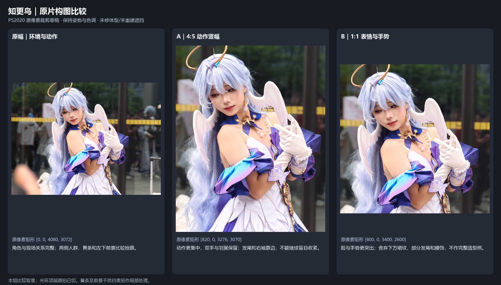
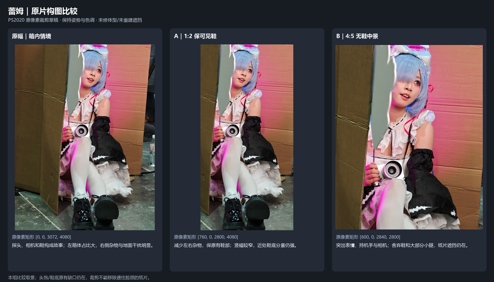

# 构图与姿态的针对性核对

可移植证据说明：本文件内资源相对路径以本文件所在目录为基准。`origin:unbundled/...` 仅保留未随包携带的历史来源标识，不是可访问文件，也不要求加载；历史观察、数值及接受范围保持原记录。

2026-10-04。任务是验证已有参考能否用于这两张照片的构图与下次拍摄指导。本轮没有扩大到新的教程清单，未看付费内容。

## 实际完成

- 免费 V07 摆姿示范新增核对六个暂停画面，其中 123.50 秒与 125.41 秒相隔约 1.91 秒。确认“右手抓裙边”的明确指令及其后手与衣料接触变得更清楚。记录见 `records.json` 和独立的 `scoped-frame-review.md`。
- 两张原片各制作原幅基准和两个裁剪方案，共六个 PS2020 轻量 JPEG，另排成两张对照图。只做取景、缩图与分享色彩转换；没有美型、调色或遮挡重建。实际查看对照图和裁剪边界。
- 两张原 JPEG 哈希保持；既有 PS 稿件与原活动稿恢复。渲染记录和限制见 `preview-render-report.md`。

视频仍为关键画面核对，连续全片观看为 0。没有连续看清两帧之间的运动，不能评价动作流畅性。T01/T05 是成片实例，T03 换成门框背景；这些不能组成只有一个变量的前后实验。T06 仍显示手部步骤，未确认头颈肩调整指令或效果。

## 知更鸟：推荐先用 A，看动作整体

A 的原像素矩形是 `[820,0,3276,3070]`，2456×3070，4:5。双手、羽翼、项链和主要袖形相互联系，背景分量降低，原有头倾仍成立；这次没有看到必须搬头或扶正的构图证据。右袖、发尾已靠边，不继续盲目收紧。

B 是 `[800,0,3400,2600]`，2600×2600，适合单独突出表情与手势，代价是下方裙装、部分发尾与腰饰。原幅仍适合环境叙事。三者均留下原拍截断的光环；黄条和前景需要另列局部处理，纯裁剪没有把它们处理干净。

下次保留这个动作，先横移摄影师检查黄条与头翼关系；同机位补完整光环/衣袖的宽版。如果想比较头倾，再补头倾稍减的一张，保留肩、手和羽翼的连贯关系。

## 蕾姆：保鞋不宜强行收成窄幅

A `[760,0,2800,4080]`，2040×4080，1:2，虽然减少两侧杂物，但显窄，近处鞋底仍占很大分量。它是验证裁剪局限的候选，不建议自动用它替换原幅。明确要保鞋时，优先保留较宽画幅后单独处理左箱/现场杂物；如希望 4:5 且保持原片全部高度 4080，宽度需 3264，可规划总计约 192 像素的背景扩边，不能通过压缩人物或切鞋凑比例。扩边不能补回原拍已缺失的鞋底、头饰。

B `[600,0,2840,2800]`，2240×2800，4:5，更突出探头表情、手和相机，适合无鞋中景，但灰白纸片仍遮住脸颈。裁剪只是减小纸箱的画面分量，没有解决被挡内容。局部开口设计应先保证脸—下颌—领口的可见连接；需要新增半边颈肩时，列明缺失区域并优先用同场本人无遮挡参考。

下次先移开/折回灰白纸片补同姿态本人参考；拍保鞋照时，比较鞋底稍转开和相机退后重新取景的版本，另保留完整头饰与鞋的宽版。退后会改变透视，不作为严格同透视拼接素材。

## 可复用的简洁判断

收到照片先选主目标（表情、完整衣装、动作环境）；比较原幅和少数裁剪；再分辨背景干扰、透视、姿态、遮挡缺失各自的影响。构图成立仍可在授权的自然美型范围内做协调轮廓；没有必要为套网格改头，也不能用收细身体代替解决挡脸纸片。

拍摄引导可以把手安排到具体道具/衣料接触点，再检查上臂和前臂轮廓；视频只证明此具体动作可被清楚引导，未证明更显瘦。头颈肩的效果不能套用这一段的结论。

后续不再泛泛扩大检索。实际遇到某种姿态或遮挡的缺口时，再找匹配示范、同场帧或原作者案例。
