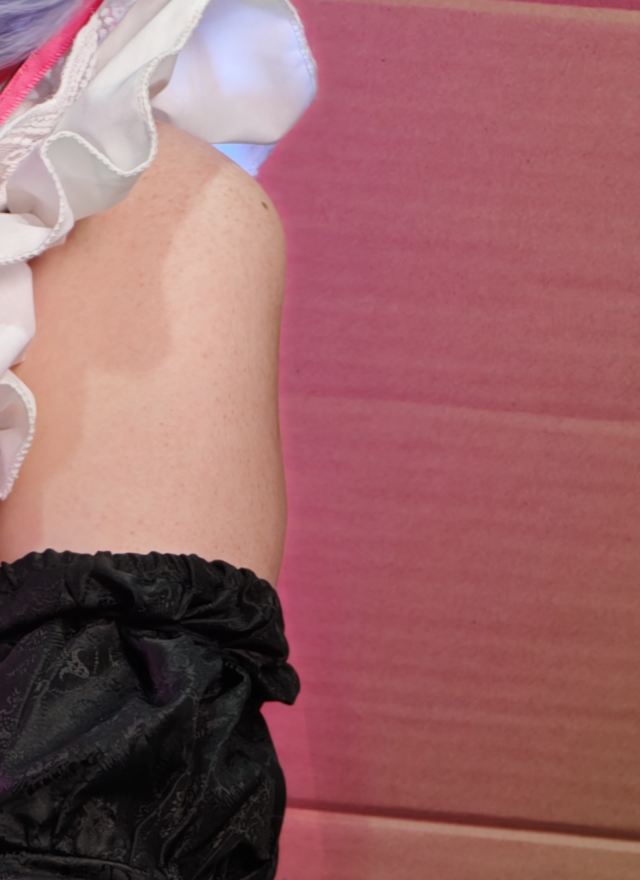
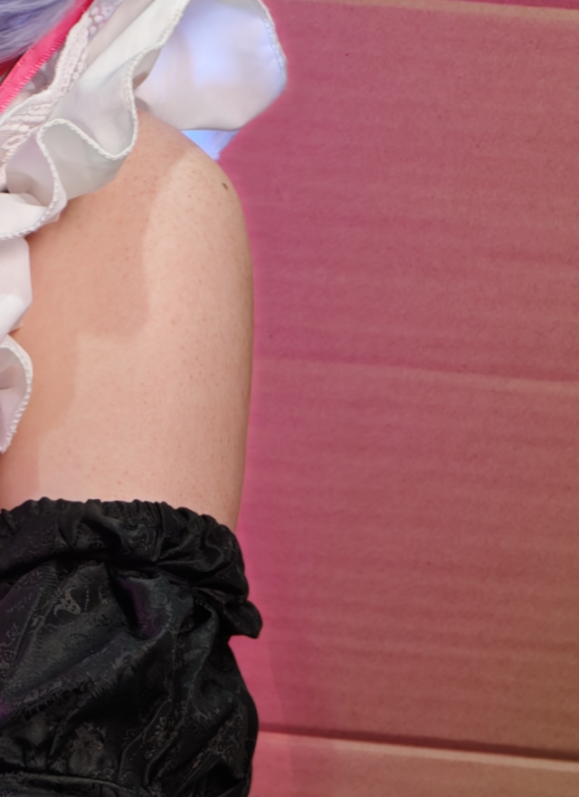
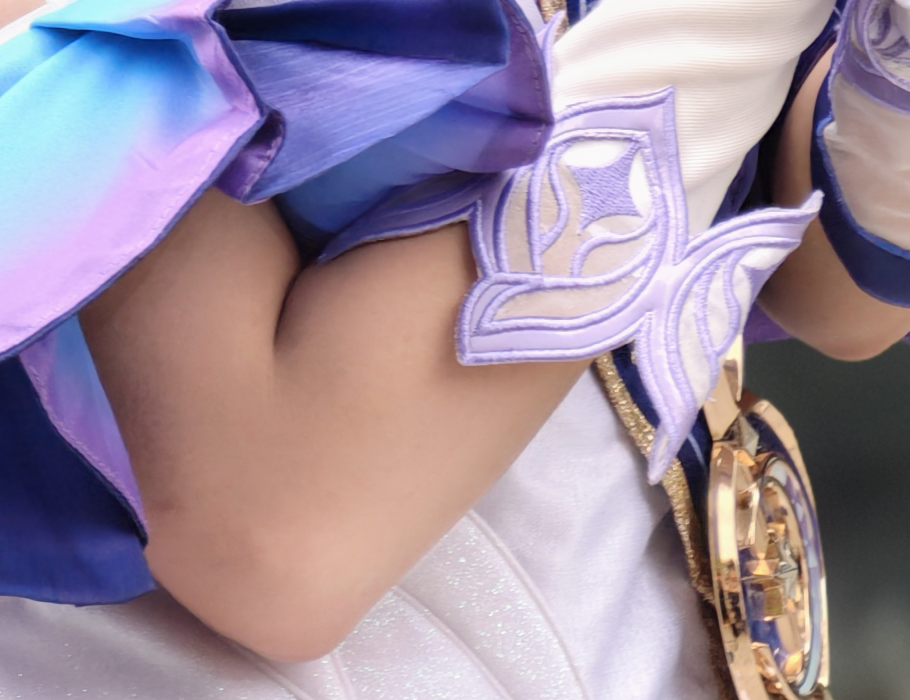
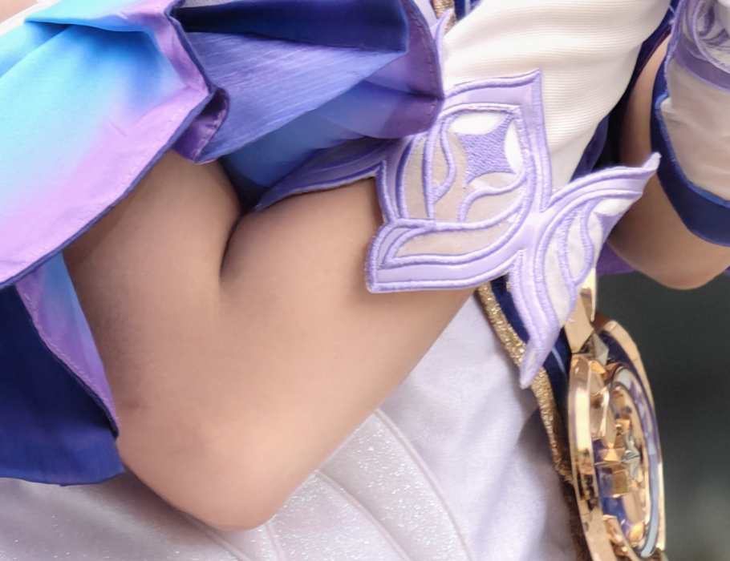
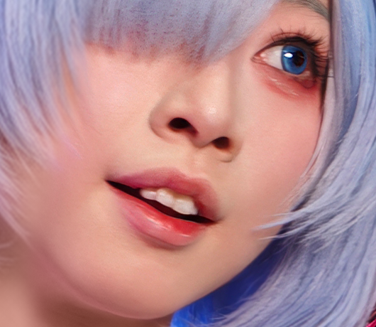
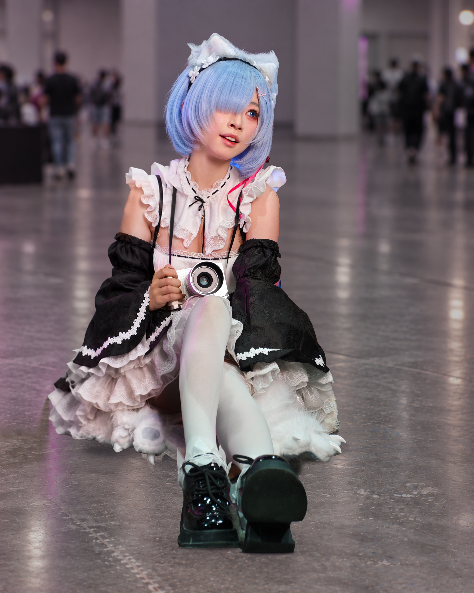

# 个人自然美型案例

本页是案例提供者在 2026-10-03 至 2026-10-07 的历史反馈与执行记录，不是当前使用者的审美或操作授权。新任务的取景、去人、重建、身体调整和保存位置，以当前请求及已确认方案为准。只查看相关案例；“前”可能是早期工作图，失败版本不作新编辑基底。此次资料整理未重新验收历史照片。

先从[成片示例索引](../assets/examples/README.md)选择对应版本；[局部案例索引](cases/README.md)用于查失败与修正过程。NS01—NS04 的八张历史 ROI 像素原样保留，其中蕾姆旧图已归入 `cases/history/`，不再作为当前效果入口。原副本的来源标识、哈希及压缩记录见 [case-files.json](case-files.json)，技术检查见 [case-evidence.json](case-evidence.json)；照片不因随包收录而获得上传至外部服务的授权。后续案例仅收录必要记录和指定 JPG，逐张标注认可、保存或待完善状态，不附所有旧版、原片或大型 PSD。

| 编号 | 已记录状态 | 主要用途 |
|---|---|---|
| NS01 | 上臂凹陷被否定；连续修正未记录最终认可 | 连续轮廓与两端衔接 |
| NS02 | 用户要求继续白、亮；最终版未明确获确认 | 肘部与邻近肤色的过渡 |
| NS03 | 鼻旁柔化获“不赖”评价，仅限该局部 | 光影与鼻形分开判断 |
| NS04 | 蕾姆 v11 被否定；后续 v12 获认可，见 NS08 | 保存早期粉光、颗粒和切面失败边界 |
| NS05 | 爱莉希雅、西施仍待进一步精修；dora 最终状态见 NS08 | 背景改善不替代人物精修 |
| NS06 | dora 背景修正版改善了色块，不能据此认定人物达标 | 补片尺度与景深 |
| NS07 | 宫本樱旧版补全失败；后续状态见 NS09 | 手—衣带—衣缘的完整连接 |
| NS08 | dora 最终 v4、蕾姆 v12 整体达到案例提供者预期 | 对应最终版本的精致程度与完成度 |
| NS09 | 宫本樱 v8 整体与位置获认可；v9 获保存指示 | 锁定认可结构后的材质收尾 |
| NS10 | 狩司司 110 已继续返修并保存 v4；另收录 113 v2、114 v1，均未记录全图认可 | 道具整件检查、附件识别与不同坐姿的构图取舍 |
| NS11 | 阿昭颈部小修后仍被问偏长与协调，未记录最终认可 | 整体比例不能靠局部光色验收 |
| NS12 | 群像 111 撤回补鞋／下扩；气色 v2 已交付，未记录全图认可 | 逐人检查、派生层依赖和展示 |
| NS13 | 神里 v2、知更鸟 v8 为案例提供者本次指定收录的已保存版本；未据此补写全图认可 | 半身构图、浅色假发、妆造与硬质饰件保护 |

## NS01：上臂整段连续，避免中心凹陷

- **反馈与处理**：只收中段造成内凹；关闭失败几何层，从稳定基底重做肩下—臂外侧—袖口的连续过渡，保护关节、褶痕、衣袖和背景线。
- **可迁移判断**：整段利落且仍有自然凸度；不能只看最窄处。弯肘、肌肉收缩、透视和衣料起伏不自动视为缺陷，历史幅度不作预设。
- **证据范围**：3072×4080 阶段图只在 [1900,1040,2390,1870] 内改变，域外 RGB16 零差异，仅证明范围。两张同一 ROI [1800,1020,2440,1900]，640×880、RGB16、原 P3、未缩放；连续修正版没有明确最终认可。

## NS02：手肘提亮，按邻近皮肤衔接

- **反馈与处理**：肘部孤立发黑、上下色差明显，用户希望进一步白、亮。用局部明度与独立颜色调整覆盖关节及上下过渡，保留折痕与体积。
- **可迁移判断**：整体不突兀，局部没有亮斑、灰边或平白色片。真实逆光、袖口遮光和角色妆色需按本图解释；本例偏好不变成统一增白。
- **证据范围**：改动限于 [1100,2050,1630,2540]，域外零差异、16 位/P3 保持，无新几何或磨皮。两张同一 ROI [1030,1870,1940,2570]，910×700、RGB16、原 P3、未缩放；未记录用户确认 v6 已满意。

## NS03：鼻旁先柔光，不默认改变鼻形

- **反馈与处理**：鼻旁硬线与妆面不衔接；06 柔化后用户评价“不赖”。先区分鼻翼、修容、现场阴影与旧蒙版接缝，再柔化局部反差，保护鼻孔、鼻翼、嘴角和眼妆。
- **可迁移判断**：过渡更柔仍能解释立体结构，无白边或光晕。认可限于鼻旁局部，不授权其他照片瘦鼻、去掉所有阴影，也不认证全图。
- **证据范围**：母版仅 [1580,550,1820,770] 内变化，域外零差异、裁剪及 ICC 保持，无新液化、生成或妆容重画。两张 ROI [1430,490,1960,950]，530×460、8 位诊断预览、无嵌入 ICC；不据预览推断母版属性。

## NS04：蕾姆当前效果与历史粉光问题

**当前效果请先看已确认的 [蕾姆 v21 成片](../assets/examples/rem-v21.jpg)**。下方历史图只解释粉边、颗粒和蓝发切面的失败过程，不能作为本例最新精修标准。

- **历史反馈**：换背景后出现无来源粉边、蓝发切面；旧专项内部检查曾通过，但 2026-10-05 用户仍否定 v11 的噪点、棱角和粉光。历史目视还记录刘海点状杂色、肩部颗粒／红点及发缘硬切。后续 v12 获认可（NS08），不能回溯认可 v11。
- **可迁移处理**：按新环境的光源和材料校正彩光，保留亮度纹理；发束轮廓在责任像素层或蒙版接回上下连接。合理彩灯不统一删除，噪声、妆面与真实皮肤纹理分开判断；借样或生成的隐藏身体／衣装仍是推断。
- **证据范围**：08→09 蓝发阶段仅 [1260,610,1580,1280] 内变化，域外 RGB16 零差异，不代表此前光线重构全程。下方两张分别为 820×998、1000×871 的 8 位诊断预览，视野不同，不作直接像素差分。
- **漏检教训**：早期记录曾把技术验证当整体通过，随后同类问题被再次指出。销项应来自实际成片复看，文件和像素属性不能替代视觉检查。

历史局部按需查看：[早期过强粉边](cases/history/ns04-rem-head-before.png)、[早期蓝发／粉光修正阶段](cases/history/ns04-rem-head-intermediate.png)。两张均不是 v12，也不代表 v11 获认可。

## NS05：背景与构图改善不等于人物精修到位

- **状态**：2026-10-05 用户要求爱莉希雅、dora、西施继续精修人物；整批“能接受”不能扩展为这三张已满意。此后仅 dora 最终 v4 获明确认可；本页未记录爱莉希雅、西施新的通过状态。现按案例提供者要求收录[爱莉希雅已保存版](../assets/examples/elysia-saved-20261005.jpg)，用于场景与妆造参考，仍标为人物精修待完善；收录请求不等于撤销此前的不满意反馈。
- **历史观察**：当时改进集中于背景、取景、亮度和肤色。爱莉希雅需关注鼻旁／眼下／口周和束腰体积，dora 需关注眼窝／鼻旁／嘴周和腰前软衣；西施已平滑，不宜继续磨白代替五官和颈肩改善。
- **可迁移判断**：肤质、五官呈现、适用几何和软衣体积各自比较收益，保护硬甲和专有纹样；不把裁剪后人物变大当美型。历史查看覆盖成片及脸／腰局部，未审核 PSD 全部操作，不能断言此前完全没有几何处理。旧缺口记录也不构成已实施的证据。

## NS06：dora 的背景色块

- **阶段状态**：2026-10-05 旧对话中，新版背景因小块补片大幅拉伸再模糊形成马赛克式色块；后续背景修正版恢复更连贯的现场结构。该局部改善不表示人物精修达标，最终接受状态见 NS08。
- **可迁移教训**：补片检查透视、纹理尺度和景深；适屏看色块，原尺寸看重复／拉伸。失败时撤回责任补片，不继续加模糊。未随包收录这两份旧工作图。

## NS07：宫本樱的遮挡、手绳与衣缘（2026-10-05 历史失败）

- **失败状态**：用户反复指出衣带质感、手部模糊、手上方缺块、手下方粗细不一／马赛克和衣缘缺口；旧答复“已核对母稿”不构成视觉通过。后续 v8／v9 状态见 NS09。
- **历史观察边界**：旧最终版仍有底部黑色遮挡；加强版补出腰腹与衣料，但右手附近拖影、衣带到腰头的粗细与清晰度、腰侧接缝仍不自然。原片本有部分手指运动虚影和阶梯状衣褶，不能全归为修图新增；当时未确认用户所指上衣缺口的精确位置。新增腹部／衣料属于推断，本次资料整理不新增修复。
- **可迁移教训**：区分画内遮挡和画外缺失；保护真实手指、衣缘与带子锚点，查看整条连接、全部新增区和相邻原区，不能补完一小段便认证整张。旧原片、加强版和最终版未随包收录。

## NS08：两次最终成片达到预期（2026-10-06）

- **接受依据**：案例提供者在看过蕾姆 v12 后说“目前这两次最终已经能达到我的预期了”，对应 dora 最终 v4 与蕾姆 v12；不包括其他模特及失败／撤回阶段。见 [接受记录](../assets/evidence/accepted-finals-20261006.json)。
- **dora 最终 v4**：完成肤质、五官／下颌、软衣腰部、肩臂、小腿及全局光色收尾，保留场馆人群。真实武器参考否定旧推测枪尖后，保留真实枪身自然出框，收紧至 3248×4108，3072×4080 原片按 (112,0) 放置、无缩放或裁失；未补完整枪口，未拉长腿。见 [编辑及接受记录](../assets/evidence/dora-v4-edit-record.json)。
- **蕾姆 v12**：沿用 3800×4750 保鞋构图，处理皮肤、眼唇及脸颈光影，微调下颌、肩臂—袖装和小腿，保住膝踝、相机握持与鞋透视；腰部只按可见衣料处理。局部供体修复发缘、刘海和耳间乱毛，原生修补清除纸箱残底、接回掌缘，按材质统一粉光与地面。见 [实际检查及接受记录](../assets/evidence/rem-v12-final-qa.json)。
- **复用边界**：可参考精致程度和完整收尾，不能照搬脸型、体型、位移图或强度；隐藏区仍不等于真实恢复。原生几何、光色和局部生成的分工见 [实验摘要](engine-experiment-history.md)。当前成片见[示例索引](../assets/examples/README.md)，分层 PSD／PNG 母版不随包收录。

## NS09：宫本樱 v8 结构认可 → v9 材质收尾与指定目录交付（2026-10-06）

- **接受顺序**：v8 后用户说“剩下的只需要把右侧的线弄真实点就好了！非常不错”，认可整体和位置、限定下一步；v9 后说“保存一下吧”，作为当前保存定稿，不改写成逐项无缺陷保证。[v8 QA](../assets/evidence/sakura-v8-final-qa.json) 的“待反馈”是导出当时状态；[v9 QA](../assets/evidence/sakura-v9-final-qa.json) 已记录后续保存决定。
- **结构与材质**：v8 依据同套衣装三张真实照片，把右带落点移回侧腰、下带贴身，手与脐部不变；不同姿态允许两侧投影不对称，不照抄像素距离，隐藏缝合点仍未知。v9 锁定这些几何，仅减弱棕色描线感、轻柔边缘、加入低幅度明暗及贴肤段窄接触暗部，悬空段不统一加投影。
- **执行边界**：v8／v9 本轮无新生成，v9 用原生 PS 图层、曲线、滤镜与蒙版；实际复看只支持所查范围未见新增明显断线、光晕或落点偏移。见 [最终 JPG](../assets/examples/sakura-v9.jpg) 和 [v9 修图记录](../assets/evidence/sakura-v9-retouch-record.txt)。
- **交付教训**：当时用户指出未保存至指定目录后，才补齐 JPG、16 位 PNG、分层 PSD 和记录并逐文件核对哈希。会话产物存在不等于指定位置交付完成；历史目录不作为新任务默认路径，包内仅收录上述参考与记录。

## NS10：狩司司三张已保存示例与球拍返修

- **110 号当前版本**：[v4 精修 JPG](../assets/examples/shousisi-110-v4.jpg)。该图选构图 B，用户授权去右下遮挡、弱化路人、收腰腹及拉腿；早期补出的球拍被指出正反面混接、弯曲，之后已继续返修并保存 v4。v4 制作记录称弯曲观感改善，但未记录用户最终认可；不能把旧反馈直接写成 v4 仍被否定，也不能把内部复核写成用户满意。
- **另外两张**：[113 号 v2](../assets/examples/shousisi-113-v2.jpg)为环抱手臂坐姿的已保存版；[114 号 v1](../assets/examples/shousisi-114-v1.jpg)为双手持发、交叠腿坐姿的已保存版。分别保留原片编号，不按相近角色或文件夹日期合并版本，均未记录全图认可。
- **可迁移教训**：拍框、网面、拍杆与握持方向一起检查前后缘和透视，不能只看新弧线。另一次附件误认被用户纠正为腿后蓝带，并仅对该物件授权删除；新图先识别物件，不继承去带、去人或美型授权。三张坐姿联看头颈、腰腹、腿脚与画边，不把一张的构图方案或拉腿幅度套给另外两张。
- **证据**：原样收录及各版本的保存依据见[新增示例记录](../assets/evidence/example-additions-20261007.json)；本次收录不重做照片或追加审美认可。

## NS11：阿昭的颈部比例

- **状态与教训**：用户问颈部是否需调整，小修后仍认为偏长，要求看整体协调。联看头、颈、肩、发尾、领口与头身关系，区分光影和长度；局部顺滑不等于整体协调。未记录最终认可，不形成默认缩颈参数。

## NS12：群像111补鞋撤回气色漏检与派生层（2026-10-07）

**当前示例：[群像 111 v4](../assets/examples/group111-v4.jpg)**。

- **范围与状态**：该图选 B 并限定保留三位脸完整成员，随后明确暂不下扩／补鞋。气色 v2 为 3072×3840，仅沿用上裁 240px，无下补；已交付但未记录全图认可。见 [v2 修图与交付记录](../assets/evidence/group-111-v2-edit-record.json)，不扩展其检查范围或认可状态。
- **补全边界**：生成未取得可用结果，另获授权的原生 PS 补鞋试验也未成立。已有鞋纹不能证明缺失鞋头形状；材质重复、拉伸和结构不可信时停止，不因后续调色重新启动已撤回扩边。
- **逐人与依赖检查**：用户指出左侧唇色偏黑后才补局部唇部与脸／眼周光色。群像按人检查气色、保留原妆和纹理，不统一增红增白。背景供体带入白扶手残片时，除改供体／蒙版，还须重建已烘焙旧补片的背景虚化层。
- **展示教训**：对照变小来自容器高度与照片自适应互相影响，不是照片质量的接受或否定。旧 460／400px 高度限制已经撤销；交互对照默认沿主 skill 的桌面 720px 规则，当前使用者可明确调整。静态平台不能控制 CSS 时按可用能力保证等尺度、完整画面和细节可辨。

## NS13：神里与知更鸟的已保存示例

- **收录版本**：[神里 v2](../assets/examples/kamisato-v2.jpg)、[知更鸟 v8](../assets/examples/robin-v8.jpg)，2026-10-07 按案例提供者要求从已保存 JPG 原样收录。来源和哈希见[新增示例记录](../assets/evidence/example-additions-20261007.json)；未新增精修或补写全图认可。
- **可观察重点**：神里联看浅色假发与面部、颈肩光色、握刀手势及刀身直线；知更鸟联看侧倾头颈、交叠手臂、浅色假发、羽翼与金属头饰。以上是本次看图选择的参考重点，不从单张成片反推已实施的工具、参数或修改量。
- **使用边界**：参考角色妆造、主体与背景的关系及材质衔接，不把旧版取景、截断、局部纹理或脸型当作所有新图的目标。

## 用案例加速

按当前问题选案例，复用决策、保护关系和验收位置；参数、取样肤色、背景策略与范围按当前照片重定。技术检查、实际看过的范围和用户接受分别记录，不为调用本库重跑所有案例。
